# WISEPACK

**Intelligent Robotic Sorting and Volume-Optimized Packaging of Nuclear Waste
with Human-in-the-Loop AI**

A running software demonstrator of the WISEPACK novel contribution -
**geometry-aware container packaging with Digital Twin validation and operator
approval** - built as ROS 2 Jazzy modules over DDS with a FIWARE NGSI-LD audit
trail.

| | |
|---|---|
| **Scope** | Interview demonstrator, not the nine-month TRL6 implementation. See [Limitations](#17-limitations). |
| **Runtime** | ROS 2 Jazzy on Vulcanexus / Fast DDS, Orion-LD (NGSI-LD), FastAPI dashboard |
| **Host requirements** | Docker only. No host ROS 2, no host Python packages. A no-Docker mode also works. |
| **Licence** | MIT. Reuses **TEMPO**, **HARVEST** and **HARMONY** - see [NOTICE](NOTICE) and [§19](#19-attribution). |
| **Tests** | unit, contract, QoS, cut-aware, inventory, logistics, whole-process, anomaly, diagnostics, behaviour-tree, media, Isaac backend and headless-browser |

---

## Full WISEPACK demonstration video

> **Video coming soon.** This walkthrough will demonstrate all four execution and
> data modes, operator decisions, anomaly recovery, physics-based execution in
> Isaac Sim, safe
> scene reset, FIWARE traceability and diagnostics.

<!-- Replace this placeholder with the final public demonstration video link. -->

It will cover `sim`, `fiware`, `isaac` and `isaac-fiware` modes, Human-in-the-Loop
approval, anomaly response, scene reset, Container Inventory, Diagnostics and
native WebRTC visualization. Until it is published, the images below are the
evidence, and every one of them is generated from the running system.

## What this demonstrator does, in nine images

Every asset below is generated from the running system by the scripts in this
repository - no mock-ups, no hand-drawn diagrams. Captions state exactly what is
real, simulated, measured or not yet implemented.

### 1. The operator's view

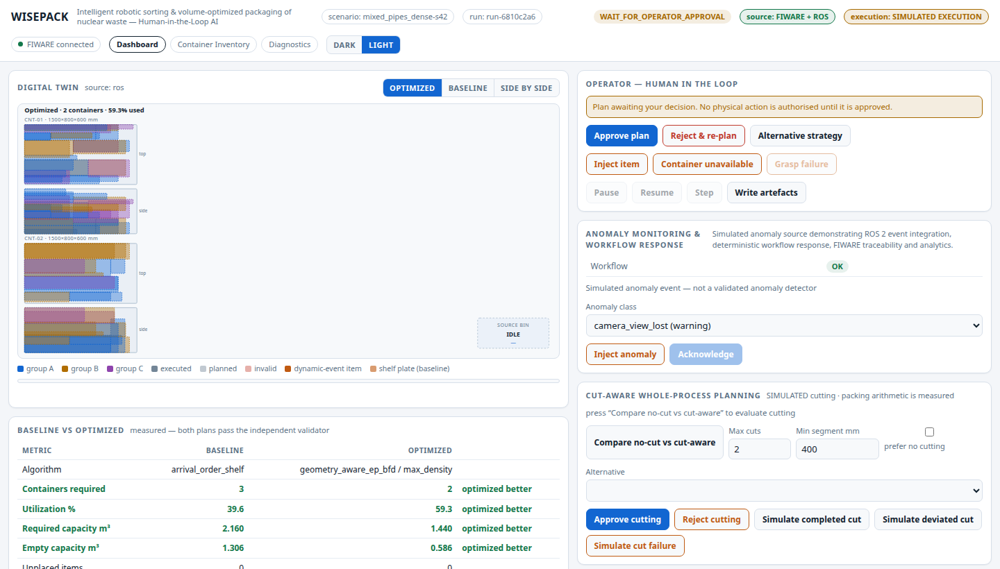

*`mixed_pipes_dense` awaiting approval, captured from a **live deployment**:
state read back through Orion-LD (`source: FIWARE + ROS`) while the Digital Twin
renders from ROS 2. The approval gate, the anomaly panel and the KPI table are
one screen. Robot outcomes in this capture are the **simulated** execution
backend; the packing arithmetic is **measured**.*

```bash
./run_wisepack_dashboard.sh sim        # no Docker, no ROS
./run_wisepack_dashboard.sh fiware     # live ROS 2/DDS + Orion-LD read-back
```

### 2. Baseline versus optimized - the value proposition

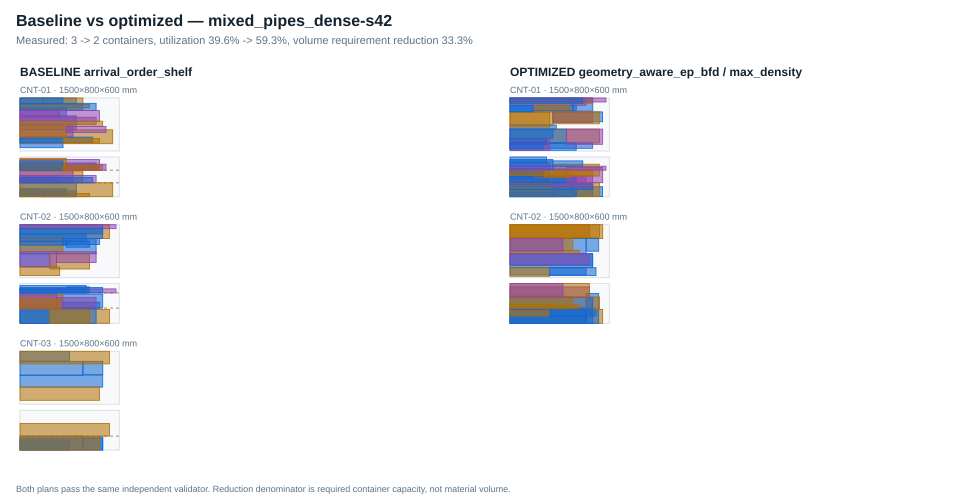

*`mixed_pipes_dense`, 40 items: **3 containers → 2**, utilization **39.6% →
59.3%**, a 33% reduction. Both plans pass the independent Digital Twin
validator. Measured by the optimizer in this repository, not estimated.*

### 3. Human-in-the-Loop approval

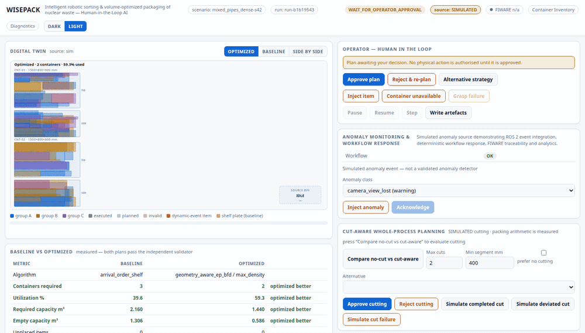

*No pick or placement executes until the exact current plan of the exact current
scenario revision is approved. The gate never times out - "nobody answered" is
not consent.*

### 4. Anomaly response and recovery

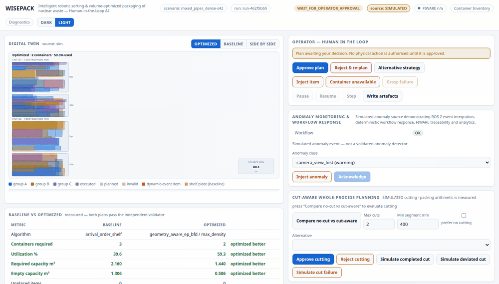

***Simulated** anomaly source demonstrating ROS 2 event integration,
deterministic workflow response, FIWARE traceability and analytics. It is **not
a validated anomaly detector**. A critical event revokes authorisation, and
acknowledging it leads either to execution or to a genuine renewed decision -
never to a gate with nothing to decide.*

### 5. Physics-based execution in Isaac Sim

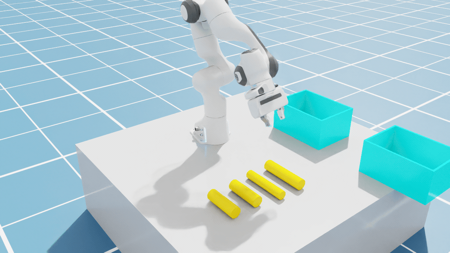

*Physics-based execution in Isaac Sim 6.0.1, not a physical robot: the arm picks
a procedurally generated cylinder, releases it above the container and **PhysX
resolves the final settling** - the item is never teleported to its planned pose.
Rendered from the scene's fixed DemoCamera.*

*These recordings were captured with the **Franka Emika Panda** backend and have
not been re-recorded for the xArm 7; they are labelled with the robot that is
actually in them rather than relabelled to match the current default. Which arm
executes is a run-time selection — see
[Supported robots](#supported-robots).*

*Two honest limitations. **Ground-truth object poses are used in the current
Isaac integration; camera-based perception is planned for the next iteration.**
And the settled pose is where physics puts it, not a reproduction of the target:
the latest four-item **Panda** run measured a **mean final-position error after
release and settling of about 35 mm** (see
[§15](#15-isaac-sim-physical-execution)). The xArm 7's per-item errors are
comparable; its four-item runs are not yet reliable for a different reason —
see [Measured xArm 7 behaviour](#measured-xarm-7-behaviour-and-what-is-not-yet-solid).*

```bash
WISEPACK_ISAAC_VIEW_MODE=desktop \
  WISEPACK_ISAAC_HEADLESS=0 \
  ./run_wisepack_dashboard.sh isaac
```

### 6. Safe repeated runs - the scene reset

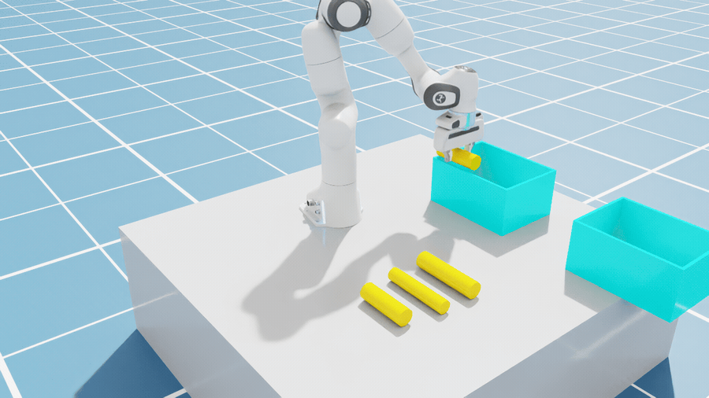

*A new software scenario is not a physical reset. "Reset run & generate" stops
the arm, releases the grasp joint, homes the Panda, clears the container and
respawns the source objects - then publishes `SCENE_READY` correlated to the
exact new run and revision. Approval stays blocked until that arrives.*

*Measured in the bounded live validation: container cleared, **4/4 objects
respawned at their source poses**, robot home to 0.001 rad, grasp joint
released, first item of the new run completed.*

### 7. Watching a physical run

Two independent options, and WISEPACK manages neither of them:

| how | what you need | who runs it |
|---|---|---|
| **Host desktop** | an Isaac window on a real display | your existing NoMachine or Sunshine/Moonlight session |
| **Native WebRTC** | NVIDIA Isaac Sim WebRTC Streaming Client | you, on the viewing machine |

```bash
WISEPACK_ISAAC_VIEW_MODE=webrtc \
  WISEPACK_ISAAC_STREAMING=1 \
  WISEPACK_ISAAC_HEADLESS=1 \
  WISEPACK_ISAAC_STREAM_HOST=<reachable-server-address> \
  ./run_wisepack_dashboard.sh isaac-fiware
```

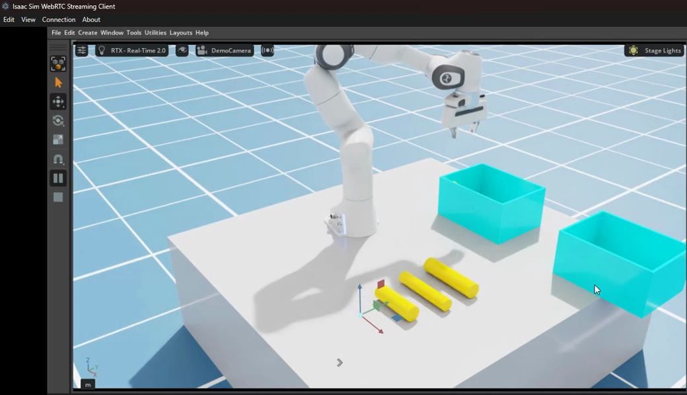

*The native NVIDIA client receiving the live stream: the same fixed DemoCamera
view, the Panda and the physical scene. Cropped to the client window. No stream
latency is quoted anywhere in this README because none was measured.*

**A browser cannot display this stream.** Isaac Sim 6.0.1 ships no in-browser
WebRTC client, so the dashboard links out to NVIDIA's native client rather than
embedding a frame that could only stay blank.
Isaac Sim 6.0.1 streams the live DemoCamera view to NVIDIA’s desktop WebRTC client. The client needs **both**
`49100/TCP` (signalling) and `47998/UDP` (media) - a TCP-only SSH tunnel
negotiates a connection and then shows no picture. No stream latency is quoted
here because none was measured.

### 8. Container Inventory and Diagnostics

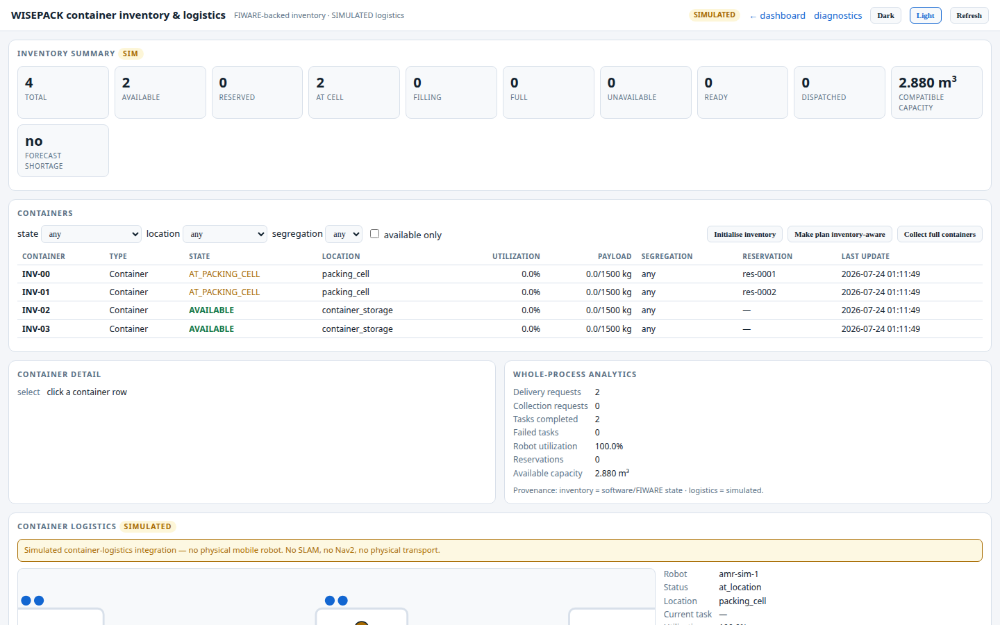

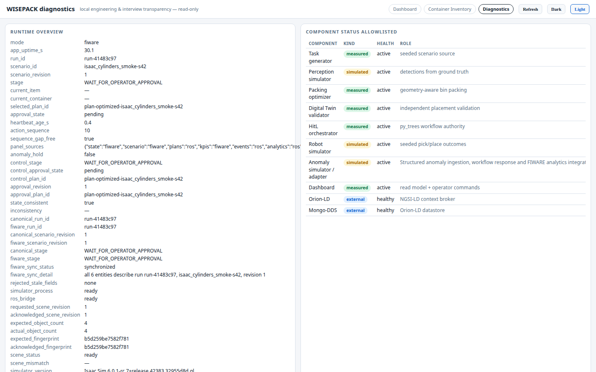

*Captured from a live `isaac-fiware` run. Diagnostics shows the canonical
ROS/DDS run beside what Orion-LD believes - here `canonical_run_id ==
fiware_run_id`, both revisions 1, `fiware_sync_status: synchronized`, *"all 6
entities describe run …, revision 1"*, `rejected_stale_fields: none` - and the
two Isaac readiness levels: `simulator_process` / `ros_bridge` ready, against a
scene whose **requested and acknowledged revision, object count (4/4) and
fingerprint all match** for this exact run.*

### 9. Architecture and behaviour

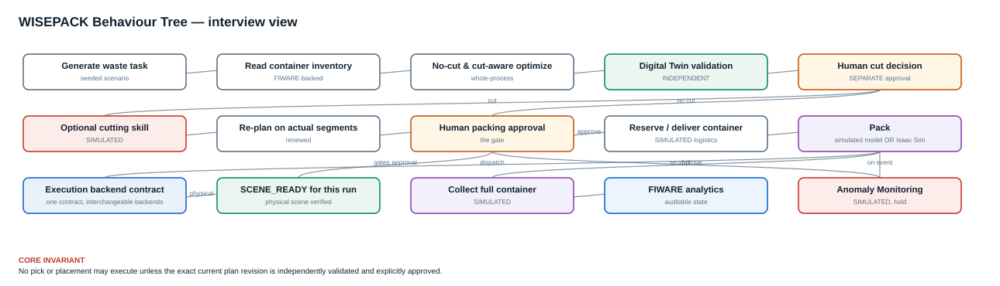

*The mission-level tree is `py_trees`; the `WorkflowEngine` is authoritative.
Execution is dispatched through **one backend-neutral contract** with three
implementations: the simulated model, Isaac Sim, and a real robot cell that is
**designed for but not implemented**. Isaac runs a **deterministic state
machine**, not a second behaviour tree - the full engineering view is
[here](images/generated/wisepack_behaviour_tree.svg).*

Regenerate every diagram and figure from source:

```bash
./generate_behaviour_tree_images.sh
./generate_demo_artifacts.sh --images-only
./generate_readme_gifs.sh                     # requires playwright + ffmpeg
```

---

## 1. The problem

Decommissioning a nuclear plant generates large volumes of metallic waste -
tubes, bent pipes, flat and curved sheets, curved panels, I-beams - that must be
packed into certified containers for transport and storage at facilities with
limited capacity. Today that packing is done either manually, exposing operators
to radiation, or by robots that retrieve objects but do not optimise container
utilisation.

The reason this is hard is easy to see and easy to under-estimate: **a pipe is
mostly air**. In the generated scenarios here, a straight tube's bounding box is
typically 60-85% empty space. Where each pipe is placed, and at what
orientation, therefore decides how many certified containers a site buys, ships
and stores - and existing bin-picking systems have no model of container
occupancy at all.

Current industrial bin-picking returns a *grasp pose*. Academic bin-packing
optimises *known geometries* with no robot. WISEPACK closes that loop.

---

## Demonstrated result

| Scenario | Items | Baseline | Optimized | Utilization | Required-capacity reduction |
|---|---:|---:|---:|---:|---:|
| `mixed_pipes_dense`, seed 42 | 40 pipes | **3 containers** | **2 containers** | 39.6% -> 59.3% | **33.3%** |

**Measured by this software demonstrator.** Both plans come from real algorithms
on real geometry, and both pass the *same independent validator* - which runs in
its own ROS 2 process and re-derives every bounding box from scratch. Reproduce
it with `./run_wisepack_dashboard.sh sim`, or from a shell:

```bash
python3 -c "
import sys; sys.path.insert(0,'wisepack_ws/src/wisepack_core')
from wisepack_core.generator import build_scenario
from wisepack_core.packing import pack_baseline, pack_optimized, OptimizerConfig
s = build_scenario('mixed_pipes_dense', 42)
b, o = pack_baseline(s), pack_optimized(s, config=OptimizerConfig(seed=42))
print(b.containers_required, '->', o.containers_required,
      f'{b.utilization_pct:.1f}% -> {o.utilization_pct:.1f}%')"
```


Three things this result is *not* saying:

- **Perception and physical robot execution remain simulated.** There is no
  camera and no robot here; only the packing is real. See
  [what is simulated](#3-what-is-simulated--read-this-before-quoting-any-number).
- **33.3% is not the proposal's >50% KPI4 target.** It is measured against a
  *competent* baseline, and the shortfall is analysed rather than tuned away.
- **It is still operationally meaningful.** One fewer certified container for
  this batch - and a certified container is a purchased, transported and
  permanently stored asset.

### The demonstrator at a glance (light theme)

Beyond the headline 3→2 packing result, the demonstrator now covers the whole
process. All media below is captured in the application's **light** theme.

| Capability | Media | Detail |
|---|---|---|
| Optimized packing dashboard |  | [§7](#7-dashboard-walkthrough) |
| Strategy comparison |  | [§8](#8-the-two-algorithms) |
| Cut-aware whole-process planning | 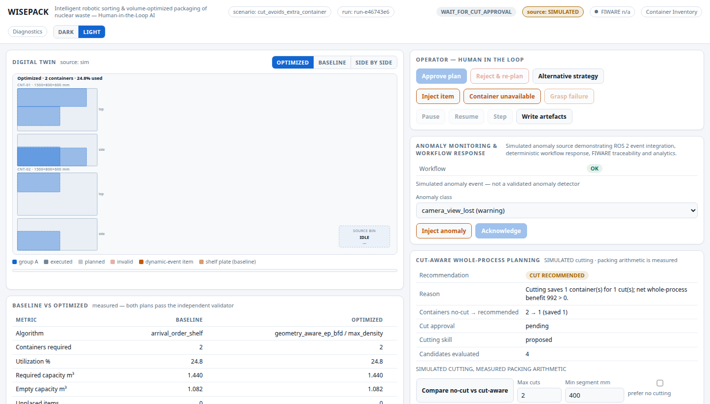 | [§13d](#13d-whole-process-optimization-cut-aware) |
| FIWARE container inventory |  | [§13e](#13e-fiware-container-inventory) |
| Container logistics | 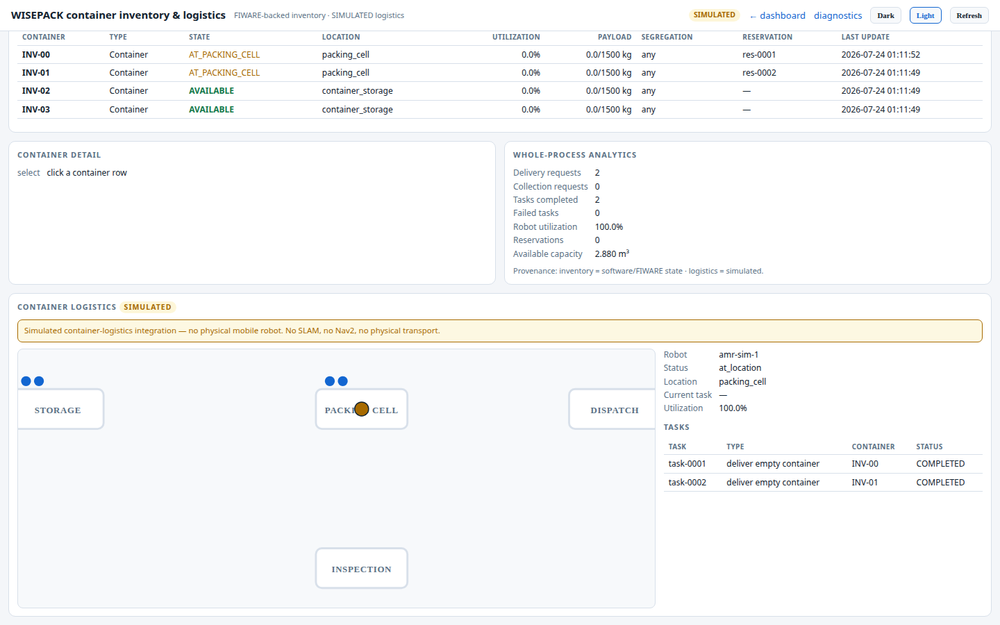 | [§13f](#13f-container-logistics) |
| Anomaly monitoring & workflow response | 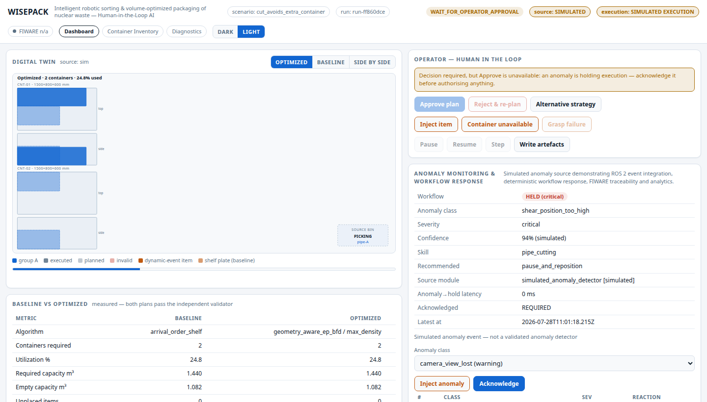 | [§13a](#13a-anomaly-monitoring--workflow-response) |
| Diagnostics | 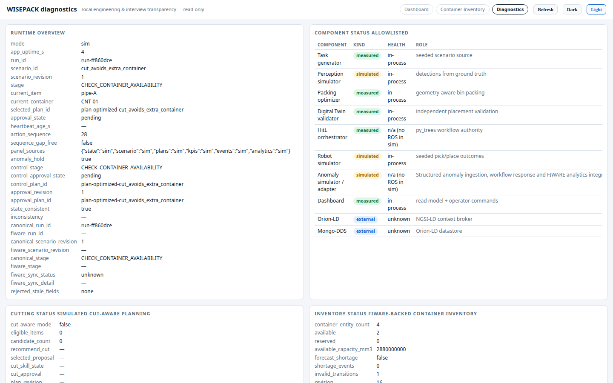 | [§13c](#13c-diagnostics-page) |

Human-in-the-Loop workflow, recorded live in simulation mode:


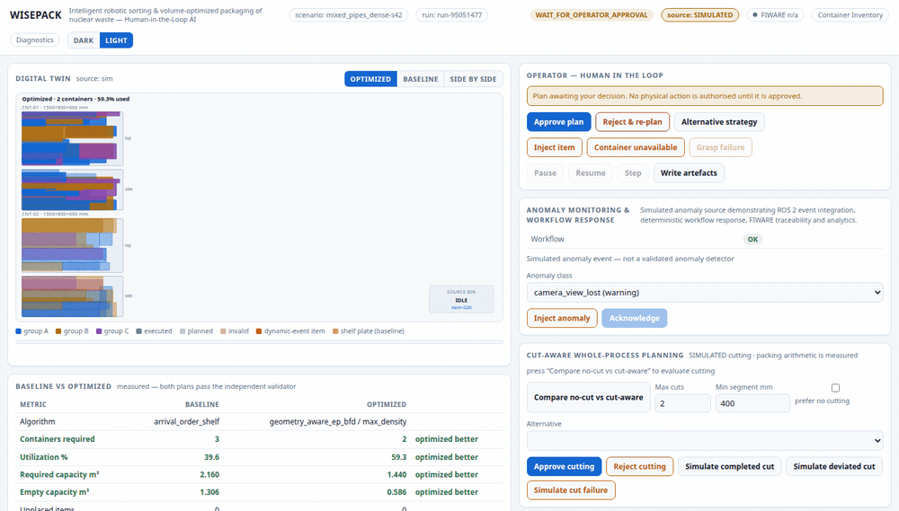
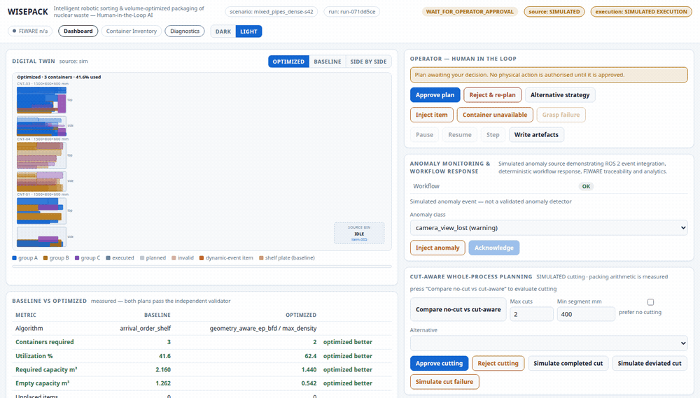

---

## 2. What this demonstrator proves

Everything in this list was executed and verified on this machine.

1. **Geometry-aware packing measurably beats a competent baseline.** On the dense
   40-pipe scenario: **3 containers → 2**, utilisation **39.6% → 59.3%**, a
   **33.3%** reduction in required container capacity. Both plans pass the same
   independent validator.
2. **Every placement is validated by code that did not produce it.** The
   validator re-derives each bounding box from the item and the recorded axis and
   checks nine hard constraints. It runs in a *separate ROS 2 process* that only
   ever sees JSON that crossed DDS.
3. **No physical action happens before a human approves.** Enforced structurally
   by the behaviour tree and independently asserted in the engine. Verified: with
   the plan pending, the workflow holds at `WAIT_FOR_OPERATOR_APPROVAL` and
   progress stays at 0%.
4. **A dynamic event triggers a real re-plan.** A high-priority component
   arriving mid-execution pauses the cycle, re-plans around the items already
   physically placed, and re-requests approval.
5. **Every workflow action reaches FIWARE over DDS.** Verified end to end: 226
   action events, a gap-free sequence, and the same sequence number readable back
   from Orion-LD as an NGSI-LD attribute.
6. **The command path is bidirectional and real.** An NGSI-LD `PATCH` of
   `urn:ngsi-ld:WISEPACKSystem:main/attrs/approval` returned HTTP 204 and moved
   the workflow from `WAIT_FOR_OPERATOR_APPROVAL` to executing. An external HMI
   can drive the approval with no WISEPACK-specific API.
7. **The demo runs with nothing installed.** `./run_wisepack_demo.sh --core-only`
   needs only Python 3.

## 3. What is simulated - read this before quoting any number

This is the most important section in the README.

**WISEPACK has two different simulation levels, and they are not
interchangeable.** One advances the workflow logically. The other runs contact
physics. A number that is honest at one level can be meaningless at the other,
so the table below says which level produced it.

| Component | Status | What is represented | What is not yet represented |
|---|---|---|---|
| Packing algorithms | **REAL** | Two real algorithms on real geometry | nothing: this is production-shaped software |
| Placement validator | **REAL** | Nine hard constraints, independent process | nothing |
| Container counts, utilisation, volume reduction | **MEASURED IN SOFTWARE** | Computed from the plan, not asserted | physical settling effects on final density |
| Optimizer computation time | **MEASURED IN SOFTWARE** | Wall clock on this machine | facility-scale batch sizes |
| ROS 2 / DDS transport | **REAL** | Vulcanexus Fast DDS | multi-site or wide-area deployment |
| FIWARE audit trail | **REAL** | Orion-LD, NGSI-LD, over DDS | site-level identity and access control |
| DDS to FIWARE latency | **MEASURED** | When the benchmark has been run; `not measured` otherwise | production network conditions |
| Perception, `sim` (default) | **SIMULATED** | Ground-truth scenario poses stand in for detection | camera, RGB-D, detector, pose estimation |
| Perception, `camera` | **MEASURED — planar pose only** | A real USB camera through the configured perception provider. Object x/y/yaw are measured on a calibrated plane and become the objects WISEPACK plans from | depth, 6-DoF pose, object dimensions (configured proxy geometry is used), and any measured detection RATE — see §14 |
| Robot, default backend | **SIMULATED - LOGICAL** | Deterministic workflow advance, geometric placement per the accepted plan, seeded grasp failures and workflow events | mass, inertia, gravity, kinematics, contacts, friction, collision response, settling |
| Robot, Isaac backend | **PHYSICS-BASED SIMULATION** | A selected articulated manipulator — UFACTORY xArm 7 or Franka Emika Panda — with rigid bodies, mass, gravity, collision geometry, contacts, friction and settling in PhysX. Cylinders are carried and released, never teleported, and the measured settled pose is reported back | real hardware, safety functions, calibration, perception |
| Pick / end-to-end success rate, logical backend | **SIMULATED LOGICAL OUTCOME** | The configured failure probability, nothing else | any physical cause of failure |
| Placement error, Isaac backend | **MEASURED IN PHYSICS SIMULATION** | Distance from the planned pose to the pose PhysX settled the object at | how a real gripper, real friction and a real cell would differ |
| Dose class | **SIMULATED METADATA** | A label carried through the workflow | any radiation model; there is none in this repository |
| 5 of 6 geometry classes | **APPROXIMATED** | Conservative bounding box, over-estimates space | exact concave geometry |

Reading the table:

* the **packing algorithms are real software**, and the placement validation and
  optimization metrics are **measured in software**;
* the **logical simulator produces simulated outcomes** - a failed grasp there is
  a seeded coin flip with no physical cause;
* **Isaac produces measured outcomes inside a physics simulation** - a failed
  grasp or a displaced item there has a mechanical cause that can be inspected;
* **neither mode is a real robot experiment**, and no result here is evidence
  about hardware;
* **perception still uses ground-truth scenario poses** in the current Isaac
  integration.

Every figure in the dashboard, the artefacts and the reports carries a
`measured` / `simulated` / `operator` / `target` label. Nothing is unlabelled.

### Proposal KPIs are targets, not results

The WISEPACK proposal states four acceptance KPIs. Three of them **cannot be
measured by this demonstrator at all**, and are reported as `not_applicable`
rather than scored - a green tick on a simulated grasp rate would be fabrication.

| KPI | Proposal target | This demonstrator |
|---|---|---|
| KPI1 Vision detection rate | > 85% | `not_applicable` - no perception model exists |
| KPI2 Pick success rate | > 80% | `not_applicable` - no robot exists |
| KPI3 End-to-end success rate | > 80% | `not_applicable` - derived from simulated picks |
| KPI4 Volume reduction | > 50% | **`not_met`: 33.3% measured** on the dense scenario |

**KPI4 is not met by this demonstrator, and that is an honest and useful
finding.** Against a *competent* arrival-order baseline - one that puts an item
in whichever open container accepts it - the measured reduction is 33-50%
depending on scenario, and never exceeds 50%. Three reasons, all real:

- **Integer quantisation.** Container counts are small integers, so the
  achievable reductions are 2→1 (50%), 3→2 (33%), 4→2 (50%). To clear 50% you
  need something like 3→1, which requires the baseline to be genuinely
  incompetent.
- **The optimizer is already at the floor where it matters.** On the curated
  scenario it reaches a *single* container. It cannot do better than one.
- **Five of six geometry classes are bounding-box approximations**, which
  over-states their volume and understates what a real geometric model would
  achieve.

Reaching >50% is a legitimate objective for the full project - with exact
geometry for all six classes, physically-executed cutting (the cut-aware planner
is implemented and validated here in simulation; see
[§13d](#13d-whole-process-optimization-cut-aware)), and a baseline calibrated
against real EDF/CEA site practice rather than a textbook shelf packer. It is not
something this demonstrator can claim.

### Results from previous HPC work are not results of this demo

The proposal cites COROB (98-99% segmentation accuracy, sub-millimetre 6D pose)
and ARISE (multimodal HRI, Digital Twin, analytics). Those are **prior results
from other projects**. Nothing in this repository reproduces or evidences them.

## 4. The novel contribution

The proposal's primary innovation is *"a new module that generates and ranks
container-filling sequences using hybrid heuristic bin-packing algorithms, with
each candidate placement validated in a Digital Twin before physical
execution"*. That module is [`wisepack_core/packing.py`](wisepack_ws/src/wisepack_core/wisepack_core/packing.py)
and its independent checker is [`wisepack_core/validator.py`](wisepack_ws/src/wisepack_core/wisepack_core/validator.py).

Three things make it more than a bin-packer:

1. **The validator is genuinely independent.** It shares no candidate-generation
   code with the optimizer, re-derives every box from first principles, and runs
   in its own ROS 2 process seeing only serialised JSON. The test suite feeds it
   hand-built broken plans to prove it rejects them.
2. **Hard constraints are never penalties.** Container bounds, collision,
   payload, segregation, orientation and support are enforced by feasibility
   filtering. No weighting can trade them away.
3. **The optimizer is not allowed to win by default.** `select_plan()` scores
   both plans and *keeps the baseline* if the optimizer loses, reporting the
   fact. A demo that always announces an improvement is not evidence of one.

## 5. Architecture

Mission-Task-Skill, in the four layers the proposal describes.

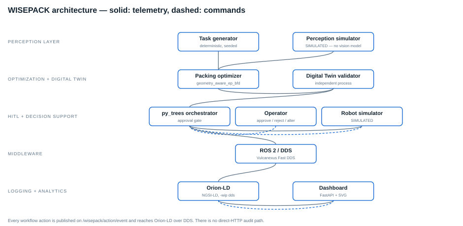

```
 PERCEPTION      Task generator ......... deterministic, seeded
                 Perception simulator ... SIMULATED (extension point for
                                          YOLOv12-OBB + SAM2 + FPFH/ICP)
 OPTIMIZATION    Packing optimizer ...... geometry_aware_ep_bfd, 3 strategies
 + DIGITAL TWIN  Digital Twin validator . independent process, 9 hard constraints
 HITL            py_trees orchestrator .. the approval gate
                 Operator ............... approve / reject / alternative
                 Robot simulator ........ SIMULATED, the default backend
                 Isaac Sim backend ...... OPTIONAL: xArm 7 / Panda + PhysX, real release
                                          and settling (see §15)
 MIDDLEWARE      ROS 2 / DDS ............ Vulcanexus Fast DDS
 ANALYTICS       Orion-LD ............... NGSI-LD audit trail
                 Dashboard .............. FastAPI + offline SVG
```

### The one architectural decision worth explaining

**There is no `wisepack_interfaces` package.** The mandatory audit path is
Orion-LD's built-in DDS bridge, and that bridge maps *only* single-member scalar
`std_msgs` - it cannot represent a custom message at all. Custom ROS types would
have forced the audit trail off the DDS path, which the brief forbids. So rich
objects travel as versioned JSON inside `std_msgs/String`, and the typed domain
model lives in `wisepack_core` as plain Python dataclasses. HARMONY reached the
same conclusion independently; its generator skips every `custom_interfaces/*`
topic as "not representable".

A second consequence: `wisepack_core` imports **no ROS at all**. That is what
makes "the same logic in both modes" true rather than aspirational - sim mode is
this code with a different transport, not a re-implementation.

## 6. Quick start

### One command, full acceptance demonstration

```bash
./run_wisepack_demo.sh
```

Builds the image, builds the workspace, runs the tests, starts Orion-LD, starts
the ROS 2 nodes, plans, requests approval, executes, injects a dynamic event,
re-plans, verifies FIWARE, and writes artefacts. Roughly 10-15 minutes on first
run (image build dominates).

```bash
./run_wisepack_demo.sh --no-fiware   # skip Orion-LD
./run_wisepack_demo.sh --core-only   # pure Python: no Docker, no ROS, no FIWARE
./run_wisepack_demo.sh --isaac-sim   # + a physical smoke run in Isaac Sim (§15)
./run_wisepack_demo.sh --isaac-sim --no-fiware
```

`--isaac-sim` adds one optional stage and changes nothing else; it skips with a
reason when Isaac Sim or a GPU is unavailable.

### Interactive dashboard

```bash
./run_wisepack_dashboard.sh              # live ROS 2 / DDS
./run_wisepack_dashboard.sh fiware       # live + Orion-LD, state read back over NGSI-LD
./run_wisepack_dashboard.sh sim          # presentation only - no ROS, no FIWARE, no Docker
./run_wisepack_dashboard.sh isaac        # live + PHYSICAL execution in Isaac Sim (§15)
./run_wisepack_dashboard.sh isaac-fiware # ...and state read back from Orion-LD

# watch the physical run (opt-in WebRTC stream, loopback by default)
WISEPACK_ISAAC_STREAMING=1 ./run_wisepack_dashboard.sh isaac   # then /simulator
```

Then open <http://127.0.0.1:8080>.

The `isaac` modes execute the approved placements with the selected robot in NVIDIA
Isaac Sim 6.0.1 on the host instead of with the simulated robot model. Execution
backend and dashboard data source are **different axes** - see
[§15](#15-isaac-sim-physical-execution). `sim` is unchanged: still no ROS, no
FIWARE and no simulator.

### Real camera perception (optional)

Put two lines in `config/local.env`:

```bash
WISEPACK_PERCEPTION_SOURCE=camera
WISEPACK_PERCEPTION_CAMERA=2                  # your camera index / device / URL
```

then start WISEPACK **exactly as always**:

```bash
./run_wisepack_dashboard.sh sim            # or ros / fiware / isaac / isaac-fiware
```

The launcher starts the perception service for you, waits for it to be healthy,
and stops it again when you Ctrl-C. **No virtual environment to activate, no
second terminal, no torch in the system Python, and no middleware on the host** —
it uses the provider's own interpreter and speaks HTTP.

Objects on the table are detected, and their measured position and orientation
become the objects WISEPACK plans from. **Perception source is a THIRD axis**,
independent of both the data source and the execution backend, so `camera`
composes with every mode above. Unset means `sim` and nothing changes. See [§15a](#15a-real-camera-perception).

### Individual validations

```bash
./run_vulcanexus_wisepack.sh validate_wisepack_e2e.sh
./run_vulcanexus_wisepack.sh validate_fiware_action_log.sh
./run_vulcanexus_wisepack.sh measure_dds_fiware_latency.sh
./generate_demo_artifacts.sh          # SVG figures + run artefacts
./generate_readme_gifs.sh             # the HitL GIFs above, from the live UI
python3 -m pytest tests/ -q
```

The launchers **always build** the ROS workspace (incremental colcon, a few
seconds) so a run can never validate a stale `install/`. Opt out deliberately
with `WISEPACK_SKIP_BUILD=1`.

Browser tests need `pip install playwright && playwright install chromium`; the
GIF tooling additionally needs `ffmpeg`. Both are optional - the rest of the
suite skips cleanly without them.

## 7. Dashboard walkthrough

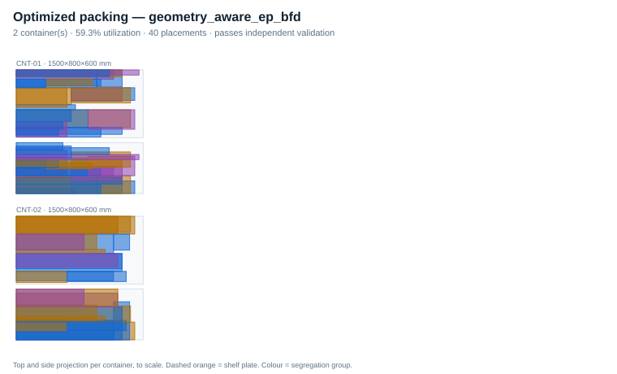

1. **Header** - scenario, run id, workflow stage, **source badge**
   (`SIMULATED` / `ROS 2 / DDS` / `FIWARE`) and FIWARE connection state. The
   badge is the honesty contract: it always names where the data came from.
2. **Digital Twin** - top and side projections per container, drawn from real
   placement geometry. Switch Optimized / Baseline / Side-by-side. Colour is the
   segregation group; solid is executed, faded-dashed is planned, red-dashed is a
   validator rejection, orange outline is a dynamic-event item, and the orange
   dashed lines are the baseline's shelf plates - the thing that explains its
   wasted height.
3. **Operator panel** - Approve, Reject & re-plan, Alternative strategy, Inject
   item, Container unavailable, Grasp failure, Pause/Resume/Step. While a plan is
   pending the page states plainly that no physical action is authorised.
4. **Scenario controls** - preset, seed, item count, length/diameter ranges,
   container spec, pick failure probability, dynamic events on/off.
5. **Baseline vs optimized** - containers, utilisation, required capacity, empty
   capacity, unplaced items, computation time, validator verdict, and which plan
   was selected *and why*.
6. **KPI cards** - each with a `measured` / `simulated` provenance chip. An
   unmeasured KPI reads **"not measured"** in muted grey, never `0`.
7. **System topology** - live node status; solid arrows telemetry, dashed
   commands.
8. **Event timeline** - newest-first action log with sequence number, stage,
   item, container, result and source; dynamic events marked.

## 8. The two algorithms


### Baseline - `arrival_order_shelf`

Items in arrival order, one fixed orientation, filled as shelves: left-to-right
along a row, rows front-to-back on a level, levels resting on shelf plates, and a
new container when the current one is full.

It is called `arrival_order_shelf` and **not** "manual industry average", because
no evidence for the latter exists in this repository.

It is deliberately simple but deliberately **not a strawman**. It will put an
item in whichever already-open container accepts it - which is what an operator
with several open boxes does. An earlier version only ever looked at the *last*
container and used 22 containers on the segregated scenario; that was an unfair
comparison and was fixed. What it lacks is optimization, not competence: no
sorting, no orientation search, no reconsideration.

Its levels rest on **zero-thickness shelf plates**. That is the assumption most
favourable to it - a real plate consumes height it is not charged for here - so
any margin the optimizer shows is understated, not inflated.

### Optimized - `geometry_aware_ep_bfd`

Best-fit-decreasing over **extreme points**:

- candidate positions maintained per container, seeded at the origin and extended
  by the three face projections of each placement;
- every permitted axis-aligned orientation evaluated at every candidate;
- feasibility filtered by the same hard-constraint rules the validator applies;
- placements ranked by a fit score dominated by **contact area** with walls and
  neighbours, with height as a secondary term and a corner bias as a
  deterministic tie-break;
- **deterministic seeded multi-start** over six orderings (priority, volume,
  length, diameter, group-major, plus seeded local perturbations);
- a **container-consolidation** improvement pass that empties the least-full
  container into the others, strictly improving or reverting;
- the best-scoring complete solution wins.

> A note on the fit score, since it is the one number that changed the result
> most: an earlier version weighted height twice as heavily as contact. That is
> correct for minimising an open stack and *wrong* for a fixed bin - it made the
> optimizer lay one flat layer and spill sideways into a second container instead
> of building upward in the first.

### Objective

```
score = packing_density
      − container_count_penalty
      − unplaced_volume_penalty
      − segregation_penalty
      − retrievability_penalty
      − excessive_clearance_penalty
```

**Hard constraints are not in this expression.** Three operator-selectable
strategies (`max_density`, `retrievability`, `segregation`) differ *only* in
these weights - same constraints, same search, same validator - which is exactly
the "compare packing strategies before execution" the proposal promises.

### The nine hard constraints

| | Constraint |
|---|---|
| H1 | every placement lies fully inside the container's inner volume |
| H2 | no two placements overlap (half-open intervals: touching is legal) |
| H3 | the container's payload limit is respected |
| H4 | the item's segregation group is accepted by the container |
| H5 | the orientation is one the item permits |
| H6 | the recorded bounding box matches the item and axis |
| H7 | each item placed at most once, and known to the scenario |
| H8 | no **new** placement targets an unavailable container |
| H9 | each placement is supported from below (floor, shelf plate, or ≥70% on other items) |

H6 catches the most dangerous bug class there is here: a packer writing a
shrunken box to make a placement "fit".

## 9. Task generator and scenarios

Deterministic: the same `(preset, seed)` produces byte-identical scenario JSON on
any machine. One seeded RNG, drawn in a fixed order, no set iteration, no salted
string hashing, values rounded at creation.

Measured results for the six packing presets, seed 42 - reproduce with
`./generate_demo_artifacts.sh` (three further curated **cut-aware** presets -
`cut_avoids_extra_container`, `cut_not_worthwhile`, `cut_result_deviation` - are
covered in [§13d](#13d-whole-process-optimization-cut-aware); nine presets total):

| Scenario | Baseline | Baseline util. | Optimized | Optimized util. | Volume requirement reduction |
|---|---|---|---|---|---|
| `mixed_pipes_small` | 2 | 30.1% | 1 | 60.1% | **50.0%** |
| `mixed_pipes_dense` | 3 | 39.6% | 2 | 59.3% | **33.3%** |
| `segregated_materials` | 3 | 25.0% | 3 | 25.0% | **0.0%** |
| `late_arrival_replan` | 2 | 32.7% | 1 | 65.5% | **50.0%** |
| `mixed_geometries` | 2 | 28.8% | 1 | 57.7% | **50.0%** |
| `curated_volume_reduction` | 2 | 33.6% | 1 | 67.1% | **50.0%** |

A seventh preset, `isaac_cylinders_smoke`, is **absent from this table on
purpose**. It is the physical smoke scenario for the Isaac backend - four
bench-scale pipe segments sized for a bench-scale parallel gripper, not for a packing contest -
and it is kept entirely separate so it cannot affect the measured
baseline-versus-optimized result above. See
[§15](#15-isaac-sim-physical-execution).

**`segregated_materials` returns 0%, and that is reported rather than hidden.**
Three segregation groups need three containers whichever algorithm packs them;
one box per group is already the floor. Geometry-aware packing cannot beat it,
and a demo that quietly dropped this scenario would be misrepresenting the
method's scope.

### The curated scenario, and why it is labelled

`curated_volume_reduction` is **hand-built to expose one specific weakness** of
shelf packing, and its construction is published in full:

- 20 items alternate long-thin (1500 × 100 mm) and short-fat (400 × 300 mm);
- the shelf baseline sets each level's height from the tallest item on it, so
  every 300 mm fat item wastes 200 mm for the thin items sharing its level, and
  it cannot rotate the long items to use the 700 mm depth;
- the optimizer sorts by volume, rotates freely and nests.

It contains **no random draw at all**, so the seed is irrelevant to it. The
50.0% it reports is what the two algorithms computed on this input - it is a
curated demonstration, **not a general performance claim**. The sizing was chosen
as the largest item count for which the optimizer still reaches a *single*
container (measured across 6/8/10/12/14/16 pairs and several geometry variants);
larger counts make the ratio worse, not better.

## 10. Human-in-the-Loop workflow


*Generated from the implementation (`./generate_behaviour_tree_images.sh`), so it
cannot drift from the code - the node set is derived from the `Stage` enum. The
[full engineering view](images/generated/wisepack_behaviour_tree.png) adds every
stage, the anomaly hold/acknowledge branch and the degraded path.*

```
IDLE → GENERATE_OR_LOAD_SCENARIO → SCAN_SOURCE_BIN → DETECT_ITEMS
     → GENERATE_BASELINE_PLAN → GENERATE_OPTIMIZED_PLAN
     → DIGITAL_TWIN_VALIDATE → WAIT_FOR_OPERATOR_APPROVAL
     → (PICK_ITEM → VERIFY_PICK → PLACE_ITEM → VERIFY_PLACEMENT
        → UPDATE_CONTAINER_STATE → NEXT_ITEM | REPLAN)* → COMPLETE
```

The flow is: plan generation → **independent Digital Twin validation** → operator
approval → execution → monitoring → (dynamic or anomaly event) → re-planning →
**renewed approval**. The core invariant, stated on the generated diagram:

> **No pick or placement may execute unless the exact current plan revision is
> independently validated and explicitly approved.**

A `py_trees` behaviour tree whose behaviours are **thin adapters** - each calls
exactly one `WorkflowEngine` method and translates the result into a
`py_trees.Status`. None re-implements planning, validation or the approval rule.

**The safety invariant is enforced twice.** `ExecuteLoop` sits behind
`AwaitApproval` in a `Sequence`, so the tree structurally cannot reach a pick
before approval; and `step_execution()` independently raises `ApprovalRequired`
if the plan is not approved. `AwaitApproval` never times out - a timeout would
mean "proceed because nobody answered".

The scenarios below are what an operator actually does. Every one of them runs
in all three modes (`sim`, `ros`, `fiware`); in live modes the command travels
`dashboard → /wisepack/operator/command → DDS → orchestrator`, the same path an
external NGSI-LD client uses.

### Scenario A - plan review and approval


*Watch for: the plan is on screen and nothing moves. The Approve button is the
only thing that starts execution - and once it does, Approve/Reject grey out
while Pause/Step become available.*

1. Generate the dense pipe scenario (**Generate & plan**).
2. Baseline and optimized plans are produced from the same items.
3. The Digital Twin validator independently checks the selected plan.
4. The workflow stops at `WAIT_FOR_OPERATOR_APPROVAL`.
5. **No simulated pick is authorised.** Progress is 0% and the page says so.
6. The operator reviews: containers required (3 vs 2), utilization
   (39.6% vs 59.3%), any placement the validator rejected, segregation-group
   colours in the Digital Twin, and the side-by-side comparison.
7. The operator approves.
8. Execution begins; every action is logged and published over DDS.

### Scenario B - the operator rejects, or asks for another strategy

1. **Reject & re-plan** records the operator's reason and re-runs the optimizer.
2. **Alternative strategy** rotates the objective weighting instead.
3. The new plan is independently validated.
4. **Execution stays blocked.** A re-plan never inherits the previous approval.
5. The operator must approve the new plan.

The three strategies differ *only* in objective weights - identical hard
constraints, identical search, identical validator, so none of them can buy
density with a boundary or segregation violation:

| Strategy | Optimises for | Expect |
|---|---|---|
| `max_density` | fewest containers, tightest fill | the KPI4 configuration |
| `retrievability` | items reachable without unstacking | more containers - the trade-off is shown, not hidden |
| `segregation` | each waste group consolidated | fewer mixed-group boxes, possibly more boxes |

### The approval invariant

An approval is not a boolean. It is a decision about **one plan of one batch
revision**, and the workflow enforces that rather than assuming it:

* `WAIT_FOR_OPERATOR_APPROVAL` always means `approval_state = pending`. The gate
  is reachable from exactly two functions - `request_approval()` and
  `revoke_approval()` - and both set the approval state as well as the stage. A
  test counts the call sites so a third one cannot be added quietly.
* An **approved plan with no active hold advances to execution**. It never sits
  at the gate, because the dashboard would then have to say "decision required"
  while correctly disabling every control - a decision the operator is asked for
  and cannot give.
* Anything that needs renewed authorisation - a critical anomaly, a re-plan, a
  scenario reset, any change to the batch - calls `revoke_approval()`, which
  **withdraws the approval, re-stamps it to the current revision and plan, and
  only then enters the gate**, in that order. Revocation is unconditional: an
  earlier version revoked only an `approved` plan, and every other state fell
  through with the stamp pointing at a decision nobody had made.
* `approve()` refuses a decision aimed at a superseded revision or a different
  plan, so a click that lands while a re-plan is in flight cannot authorise the
  replacement.

`WorkflowEngine.approval_inconsistency()` states the invariant in one place and
returns the reason it is violated; the dashboard shows that reason instead of
operator controls.

### One run, or no controls

The orchestrator's topics are latched and independent, so the dashboard's mirror
is always a mixture of whatever each publisher last said. After a reset the
scenario topic can carry the new run while the plan topic still carries the old
one - observed as scenario `mixed_pipes_dense-s42` rendered beside plan
`plan-optimized-isaac_cylinders_smoke-s42`, a plan for a different batch.

Every document the dashboard merges is therefore stamped with `run_id`,
`scenario_id` and `scenario_revision`, and the snapshot compares them:

| checked | across |
|---|---|
| `run_id`, `scenario_revision` | the scenario, the selected plan, the plan summary |
| `selected_plan_id` | the plan summary vs the published plan |
| `approval_plan_id`, `approval_revision` | the pending decision vs the selected plan |

When they disagree the dashboard reports a degraded diagnostic - *"Inconsistent
state - controls withheld: …"* - and withholds Approve, Reject and Alternative
until the orchestrator republishes a consistent set. It does **not** guess which
half is current, and it does not render the mixture. Components published by an
older orchestrator carry no stamp; those are treated as unknown rather than
conflicting, so a rolling upgrade does not disable the controls.

The Diagnostics page shows the canonical control state beside the displayed one,
which is what makes a FIWARE echo lag distinguishable from a real contradiction.

### Scenario C - a late-arriving waste component


*Watch for: the injected item appears with an orange outline, the stage returns
to `WAIT_FOR_OPERATOR_APPROVAL`, and the already-executed placements stay put.*

1. Execution is already under way.
2. A high-priority ILW component arrives (`Inject item`).
3. **Already-executed placements are frozen** - those pipes are physically in a
   container and re-planning cannot move them.
4. Only the remainder is re-optimized, around the frozen geometry.
5. The new plan is validated by the Digital Twin.
6. Execution returns to the approval gate.
7. The operator approves or rejects the revised plan.

### Scenario D - a container becomes unavailable


*Watch for: the retired container is excluded from the revised plan, and the
operator is asked again before anything else is placed.*

1. A container is marked unavailable (damage, contamination, transport booked).
2. It is excluded from all future placements, and **its id is never re-issued** -
   the container index advances past it, so a re-plan cannot silently resurrect
   a box that is out of service.
3. Placements already executed into it remain recorded; a container going out of
   service does not levitate its contents back out.
4. The remaining batch is re-planned.
5. The operator reviews the operational impact - usually one more container.

### Scenario E - a simulated grasp failure

1. `Grasp failure` forces exactly the next simulated grasp to fail.
2. The failure is logged as its own ActionEvent with `result: failed`.
3. The configured retry policy applies (`max_pick_retries`, default 2).
4. **A full packing re-plan is NOT triggered.** Re-planning a whole container
   because one grasp slipped would be wasteful and would misrepresent what
   re-planning is for.
5. Only when the retry budget is exhausted is the item abandoned, and the cycle
   is then counted as attempted-but-not-completed in the KPIs.

### Scenario F - controlled execution

| Control | Effect |
|---|---|
| **Pause** | stops automatic execution. The plan stays **approved**, so resuming needs no second approval. |
| **Resume** | continues. Refused with a stated reason if the plan is not approved. |
| **Step** | executes exactly one workflow step - useful for narrating a demo. |
| **Write artefacts** | writes the run, plan, KPI and event artefacts *now*, before or after completion, and returns the paths. |

These are **supervision and evidence-generation functions, not a safety system.**
Nothing here is a substitute for industrial safety control: in a real cell the
interlocks, the emergency stop and the safety PLC remain the authority, and this
dashboard would never be in that path.

### The Action Event Timeline

Every row in the timeline is one structured `ActionEvent` - the same record that
is published on `/wisepack/action/event`, crosses DDS into Orion-LD, and is
written to `results/wisepack-actions-*.jsonl`. Each carries:

| Field | Purpose |
|---|---|
| `sequence` | monotonic, gap-free - a missing number is a lost event, visibly |
| `timestamp` | UTC, millisecond resolution |
| `stage` | which workflow stage produced it |
| `action` | what happened (`pick_item`, `replan_start`, …) |
| `actor` | which module or person (`robot_simulator`, `operator`, …) |
| `item_id` / `container_id` | what it happened to |
| `result` | `ok` / `failed` / `retry` / `rejected` / `pending` |
| `duration_ms` | how long it took |
| `source` | `measured`, `simulated` or `operator` - never guessed |
| `details` | structured payload, truncated *visibly* if oversized |

Visual semantics in the dashboard:

- **newest first**, so the current state is at the top;
- **sequence numbers are shown** so a gap is obvious rather than invisible;
- **simulated** events are badged amber; **operator** decisions are badged blue;
  **measured** workflow actions are badged green;
- **dynamic events** get a left border so a disturbance stands out;
- in FIWARE mode the sequence number is the one read back from Orion-LD, so a
  match with the ROS sequence proves the event crossed DDS.

A normal execution cycle reads:

```
 #7  WAIT_FOR_OPERATOR_APPROVAL   plan awaiting operator decision; no physical action is authorised
 #8  WAIT_FOR_OPERATOR_APPROVAL   approve_plan - selected plan approved by operator      [operator]
 #9  PICK_ITEM                    item-001 selected from source bin                      [simulated]
 #10 VERIFY_PICK                  simulated grasp verified                               [simulated]
 #11 PLACE_ITEM                   item-001 placed into CNT-01                            [simulated]
 #12 VERIFY_PLACEMENT             placement re-validated against container geometry      [measured]
 #13 UPDATE_CONTAINER_STATE       CNT-01 occupancy updated                               [measured]
```

And a disturbance reads:

```
 #24 NEXT_ITEM                    dynamic_event:item_inject - high-priority ILW component arrives
 #25 REPLAN                       replan_start - cause: dynamic event item_inject
 #26 REPLAN                       replan_complete - 2 containers, optimized selected
 #27 DIGITAL_TWIN_VALIDATE        validate_placements - 41/41 placements pass
 #28 WAIT_FOR_OPERATOR_APPROVAL   plan awaiting operator decision; no physical action is authorised
```

**That last line is the point of the whole sequence.** A re-plan lands back at
the approval gate, so a disturbance can never be used to slip an unreviewed plan
into execution.

## 11. Dynamic events

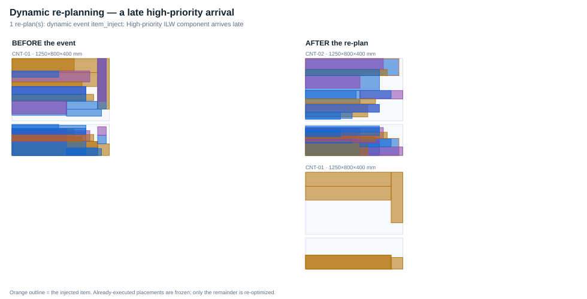

Nine event types: `item_inject`, `item_removed`, `item_reclassified`,
`container_unavailable`, `container_restored`, `operator_reject`,
`grasp_failure`, `segregation_rule_change`, `optimizer_timeout`.

Triggers are `stage:<STAGE>`, `placement:<n>` or `t:<seconds>` - deliberately not
wall-clock, so a demonstration is identical on a fast laptop and a loaded CI
runner. (HARVEST times its events on a simulated clock, which suits a day-long
farm simulation and not a 30-second packing cycle.)

Re-planning **freezes already-executed placements** - those items are physically
in the container and cannot be moved - and re-optimises only the remainder.

A `grasp_failure` deliberately does **not** trigger a re-plan: it is a retry at
the execution layer. Re-planning a whole container because one grasp slipped
would be both wasteful and a misleading demonstration of what re-planning is for.

## 12. ROS 2 / DDS contract

29 topics, all scalar `std_msgs` (see [§5](#5-architecture)). Full list in
[`topics.py`](wisepack_ws/src/wisepack_bringup/wisepack_bringup/topics.py).

Two further topics - `/wisepack/isaac/{command,feedback}` - exist only when the
optional Isaac backend is selected, and are deliberately kept out of
`all_topics()` for that reason: every entry there has a publisher in every run,
which is what lets the live QoS test treat a publisher-less topic as a bug. See
[§15](#15-isaac-sim-physical-execution).

Plan topics carry the **complete** `PackingPlan` - every placement's position,
size, axis and validation status (~27 kB for a 40-item scenario). A dashboard
cannot draw a container from "59.3% utilization", and publishing only summaries
is precisely why the live Digital Twin used to render empty.

| Profile | Topics | Why |
|---|---|---|
| `event_qos` | action events, dynamic events | RELIABLE + **TRANSIENT_LOCAL**, depth 200 - an audit trail that only exists for whoever was already listening is not a record |
| `state_qos` | scenario, plans, KPIs, execution state, action sequence | RELIABLE + TRANSIENT_LOCAL - a late joiner must see the current value |
| `heartbeat_qos` | `/wisepack/system/heartbeat` (**publisher only**) | offers Deadline + Liveliness so a strict external consumer can use them |
| `watchdog_subscribe_qos` | heartbeat (subscriber) | plain latched state - see below |
| `command_qos` | operator approval, operator command | RELIABLE + TRANSIENT_LOCAL, **no deadline** |
| `telemetry_qos` | progress only | BEST_EFFORT - genuinely high-rate |

### The QoS rule this project learned the hard way

> **A subscription must never REQUEST a Deadline or a Liveliness lease.**

A reader only matches a writer whose *offered* policy is at least as strict.
Orion-LD's DDS enabler creates a bare-DDS publisher on **every topic it
discovers** - not merely the ones it maps - and each offers an *infinite* lease
and no deadline. So any subscription requesting either policy silently matches
nothing. rclpy does not raise; the topic is simply dead.

Three separate outages in this repository traced to that one rule:

| Symptom | Cause |
|---|---|
| The entire FIWARE → ROS operator path never connected | `command_qos()` requested a 2 s Deadline |
| `Last incompatible policy: LIVELINESS`, blank live dashboard | `/wisepack/execution/state` requested a 4 s lease |
| Every KPI tile read "not measured" in live mode; timeline empty | KPI topics were BEST_EFFORT + VOLATILE, so a dashboard attaching *after* planning received nothing |

The resolution is a clean split, with the watchdog on its own topic:

```
/wisepack/execution/state     RELIABLE, TRANSIENT_LOCAL, KEEP_LAST(1)
                              no deadline, no liveliness  -> anything can read it

/wisepack/system/heartbeat    publisher OFFERS deadline + liveliness
                              subscriber requests neither, and detects a dead
                              orchestrator from the counter not advancing
                              (HEARTBEAT_STALE_S). NOT bridged to FIWARE, so no
                              generic publisher ever appears on it.
```

Orchestrator loss is still detected - the dashboard reports `DEGRADED` and holds
- it is just detected at the application layer, because the DDS-level route is
unavailable in a deployment that includes a generic bridge. `tests/test_qos_contract.py`
pins all of this, and with `WISEPACK_QOS_LIVE=1` it parses the **actual running
graph** from `ros2 topic info -v` rather than trusting the Python objects.

> **If you change a QoS profile, restart Orion-LD.** Its DDS enabler caches
> endpoint QoS from first discovery, so a running broker keeps offering the old
> policy and produces incompatibility warnings that survive the fix. Measured:
> 10 warnings before restarting the broker, 0 after.

## 13. FIWARE data path

**This is the only audit path. There is deliberately no direct-HTTP fallback.**

```
WISEPACK node → ROS 2 topic → DDS → Orion-LD DDS bridge → NGSI-LD entity
```

Orion-LD runs `-wip dds -mongocOnly` and reads
`context_broker_config.json`, generated from
[`bridge_config.yaml`](wisepack_ws/src/wisepack_fiware/config/bridge_config.yaml)
by an adapted HARMONY generator. **No custom bridge node runs at all.**

| Entity | Attributes |
|---|---|
| `urn:ngsi-ld:WISEPACKSystem:main` | `stage`, `readiness`, `approval`◄, `command`◄ |
| `urn:ngsi-ld:WISEPACKScenario:current` | `summary`, `config`, `detectedCount` |
| `urn:ngsi-ld:WISEPACKPackingPlan:current` | `baseline`, `optimized`, `selected`, `status` |
| `urn:ngsi-ld:WISEPACKRobot:arm-01` | `currentItem`, `currentContainer`, `progressPct` |
| `urn:ngsi-ld:WISEPACKActionStream:main` | `actionJson`, `sequence`, `dynamicEvent` |
| `urn:ngsi-ld:WISEPACKKPI:current` | 8 KPI attributes |

◄ = inbound (FIWARE → ROS). Every value is read as `<attr>.value.data`.

### Measured latency

Measured on this machine, `ROS 2 → DDS → Orion-LD → NGSI-LD attribute readable`,
10 samples after 2 warm-ups, zero timeouts:

| Hop | p50 | p95 | max |
|---|---|---|---|
| **ROS → FIWARE** (the audit hop) | **6.92 ms** | 7.02 ms | 7.04 ms |
| FIWARE → ROS (operator command) | 1.31 ms | 2.68 ms | 3.65 ms |

The ROS → FIWARE figure *includes* the probe's 5 ms HTTP polling interval, so it
is an **upper bound** on true propagation delay, not a lower one. Reproduce with
`./run_vulcanexus_wisepack.sh measure_dds_fiware_latency.sh`. When the benchmark
has never run, the dashboard reads `not measured` - never `0 ms`.

### Which panels read from FIWARE, and which from ROS

FIWARE mode does not claim more than it delivers. `panel_sources` in
`/api/state` names the origin of each panel, and the header badge aggregates it:

| Panel | Source | Why |
|---|---|---|
| workflow stage, readiness | **FIWARE** | audit-relevant; `WISEPACKSystem` holds it |
| scenario summary, detected count | **FIWARE** | `WISEPACKScenario` |
| KPI tiles | **FIWARE** | `WISEPACKKPI`, read back over NGSI-LD |
| plan digest, validation verdict | **FIWARE** | `WISEPACKPackingPlan.summary` / `.status` |
| Digital Twin geometry | ROS | 40 placement coordinates are not an audit record; the bridge maps a ~1 kB digest instead of a 27 kB plan |
| action-event stream | ROS | Orion-LD holds only the *latest* action (state-oriented bridge); the full stream is on DDS and in the JSONL artefact |

So the badge reads **`FIWARE + ROS`**, never a bare `FIWARE`.

### Verified behaviour, and its honest limitation

Measured on this machine (`mixed_pipes_small`, seed 42):

```
containersOptimized      REAL  1
volumeReductionPct       REAL  50
utilizationBaselinePct   REAL  30.0725
utilizationOptimizedPct  REAL  60.145
sequence                 REAL  97      (matching ROS 2)
actionJson               REAL  {"sequence":97,"stage":"WAIT_FOR_OPERATOR_APPROVAL",...}
```

**The bridge is state-oriented, and this repository does not pretend otherwise.**
`WISEPACKActionStream.actionJson` holds the **latest** action, not an append-only
log; `.sequence` holds the highest number reached. The append-only record is the
timestamped `results/wisepack-actions-*.jsonl` artefact. Historical retention in
FIWARE would come from QuantumLeap subscribing to these entities - that is
documented as an extension point, not implied as present.

### Bidirectional - verified

```bash
curl -X PATCH \
  'http://localhost:1026/ngsi-ld/v1/entities/urn:ngsi-ld:WISEPACKSystem:main/attrs/approval' \
  -H 'Content-Type: application/json' \
  -d '{"type":"Property","value":{"data":"APPROVE"}}'
# HTTP 204 → stage moved WAIT_FOR_OPERATOR_APPROVAL → NEXT_ITEM
```

A plain `"value": "APPROVE"` does **not** reach DDS. The nested `value.data`
shape is required.

### Vulcanexus is required, not preferred

The FIWARE DDS Enabler only fills a value once the publisher propagates the
`std_msgs` TypeObject. Plain ROS 2 Jazzy announces the topic - so Orion-LD
creates the entity - but does not reliably propagate the type, and every
attribute stays `"uninitialized"` forever with no error anywhere. The validation
scripts detect and explain this case rather than reporting a mysterious failure.

## 13a. Anomaly Monitoring & Workflow Response

Simulated anomaly source demonstrating ROS 2 event integration, deterministic
workflow response, FIWARE traceability and analytics. An independent anomaly
detector can publish structured OK/NOK events through ROS 2, trigger a
deterministic workflow hold, and reuse the same DDS-to-FIWARE analytics and
traceability layer **without modifying the packing optimizer**.

Stated clearly, and enforced by tests:

- **Architectural demonstration only.** This is not a validated detector.
- **Simulated anomaly source.** Every event is labelled `SIMULATED ANOMALY
  INTEGRATION EVENT`, `source: simulated`; no detection KPI is marked achieved.
- **No physical cutting operation**, and **no validated detector accuracy**.

### Relevance to the JARVIS EDF pilot

The anomaly module is application-independent. Its cutting-position,
premature-tool-closure and camera-loss examples are aligned with the anomaly
monitoring needs described in EDF Pilot Topic #2, but the stable ROS 2 event
contract can also carry perception, grasp, placement, inventory, logistics,
Digital Twin and communication anomalies.

The current events are deterministic simulations used to demonstrate workflow
response and DDS-to-FIWARE traceability. They do not constitute a validated
industrial anomaly detector and do not claim the official EDF Topic #2 KPIs.

**The data path** (`wisepack_anomaly` package → orchestrator → FIWARE):

```
anomaly source  → /wisepack/anomaly/external  (ingest seam: simulator/adapter/future detector)
                → HitL orchestrator            (deterministic reaction, LOCAL)
                → /wisepack/anomaly/event      (recorded stream, single writer)
                → DDS → Orion-LD               (WISEPACKAnomaly, analytics/traceability)
```

Safety-critical response is **local and deterministic** - the orchestrator holds
the workflow the moment the event arrives; FIWARE is an *additional* analytics
path, never the stopping mechanism.

**Deterministic reaction by severity** (verified live and in unit tests):

| Severity | Classes | Workflow response |
|---|---|---|
| `info` | `operation_ok` | record, continue |
| `warning` | `camera_view_lost`, `tool_pose_deviation` | **pause**; operator must acknowledge to resume (plan stays approved) |
| `critical` | `shear_position_too_high/_low`, `shear_closed_before_contact` | **hold**: revoke execution authorisation, preserve completed placements, require a new approval - acknowledgement alone is *not* authorisation |

Operator controls: **Inject anomaly** (deterministic class selector) and
**Acknowledge**, in the dashboard's *Anomaly Monitoring & Workflow Response*
panel, which always displays *"Simulated anomaly event - not a validated anomaly
detector"*. Every injection and acknowledgement is an ActionEvent.


## 13d. Whole-process optimization (cut-aware)

The ordinary packing optimizer is unchanged and remains the **no-cut** plan. A
separate **cut-aware planning layer** (`wisepack_core/cutting.py`,
`cut_validator.py`, `cut_optimizer.py`) evaluates whether segmenting a straight
pipe would let its pieces fit residual container cavities that the whole pipe
cannot - and, crucially, whether that is *worth it*.

The deterministic pipeline: run the ordinary optimizer → find cuttable pipes that
are unplaced or push into the last container → read residual cavity lengths →
generate a **bounded** set of cut candidates (from cavities, container inner
dimensions and equal division, capped per pipe / per plan / total) → build a
derived-item scenario per candidate → re-pack with the **same** geometry-aware
packer under each strategy → validate the cut **and** the packing **independently**
→ score whole-process alternatives. Each cut is charged its real cost: number of
cuts, minimum segment length, kerf (material swept to swarf), added cutting and
handling time, and operational complexity. Hard constraints (boundaries,
segregation, minimum segment, maximum cuts) are never penalties - a candidate that
breaks one fails validation and is discarded. **"No cut recommended"** always sits
in the comparison at net benefit 0, so cutting is recommended only when a saved
container out-earns its process cost.

Human-in-the-Loop cutting is a **separate approval** from packing approval
(`WAIT_FOR_CUT_APPROVAL` → `CUT_REQUESTED` → simulated external cutting skill →
`REGISTER_DERIVED_ITEMS` from the *actual* segment sizes → `REPLAN_AFTER_CUT` →
packing approval **again**). Approving a cut never approves the resulting packing
plan. Operator controls: compare no-cut vs cut-aware, select an alternative, limit
cuts, change the minimum segment, prefer no cutting, approve/reject cutting,
simulate a completed (or deviated, or failed) cut.

Measured on the three curated cut scenarios (computed by the packer, not asserted):

| Scenario | No-cut containers | Cut-aware containers | Saved | Cuts | Cutting time (s) | Kerf (cm³) | Recommendation |
|---|--:|--:|--:|--:|--:|--:|---|
| `cut_avoids_extra_container` | 2 | 1 | 1 | 1 | 32 | 60.3 | **cut** |
| `cut_not_worthwhile` | 1 | 1 | 0 | 0 | 0 | 0.0 | **no cut** |
| `cut_result_deviation` | 2 | 1 | 1 | 1 | 32 | 60.3 | **cut** |

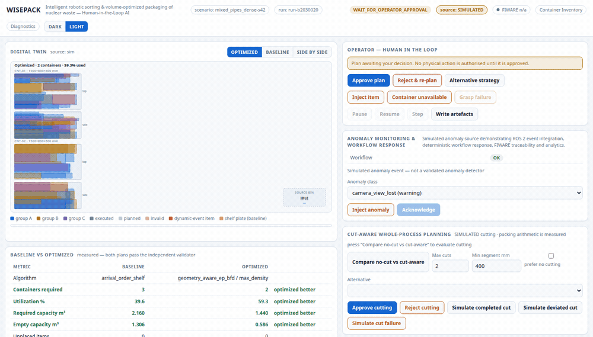

The **simulated external cutting skill** is a seam: the physical cutting
controller remains a future skill. `CUTTING_REQUEST` is emitted **exactly once**
per approved proposal revision (validated proposal + approved exact revision +
`APPROVED → REQUESTED` transition + idempotent guard), so periodic state
republication never duplicates it.

## 13e. FIWARE container inventory

`wisepack_core/inventory.py` implements a real operational inventory, not a static
table. Each container is one NGSI-LD entity - `urn:ngsi-ld:WISEPACKContainer:<id>`
- carrying **compact semantic state**: container id/type, inner dimensions, max
payload, current payload, capacity, occupied volume, utilization, remaining
capacity, compatible/active segregation group, lifecycle state, availability,
location, workstation, reservation, related scenario/plan, transport task, item
count, sealed flag, inspection state, plan/contents digests, revision, last
update, source. **Full placement geometry stays on ROS 2 / the Digital Twin / the
immutable artefacts - never in FIWARE.**

A validated 16-state lifecycle (`REGISTERED … RETIRED`) with an explicit
transition table rejects and logs illegal moves (`SEALED → AVAILABLE`,
`DISPATCHED → FILLING`, `RETIRED → RESERVED`). There is no silent field editing:
every operation (register, reserve, release, request delivery, mark
unavailable/restore, mark full/sealed, request collection, dispatch) validates the
transition, bumps the container revision, appends an audited history record and
emits an ActionEvent. The optimizer is **inventory-aware**: it may select only
containers that are available, at the current cell, segregation-compatible, within
payload and not reserved by another plan; when none are compatible the plan status
becomes `WAITING_FOR_CONTAINER` and a delivery/replenishment request is generated.

`/inventory` (<http://127.0.0.1:8080/inventory>) shows KPI summaries (total,
available, reserved, at cell, filling, full, unavailable, ready, dispatched,
compatible capacity, forecast shortage), a filterable container table and a
per-container detail with lifecycle history, reservation, FIWARE entity id, source
and revision.

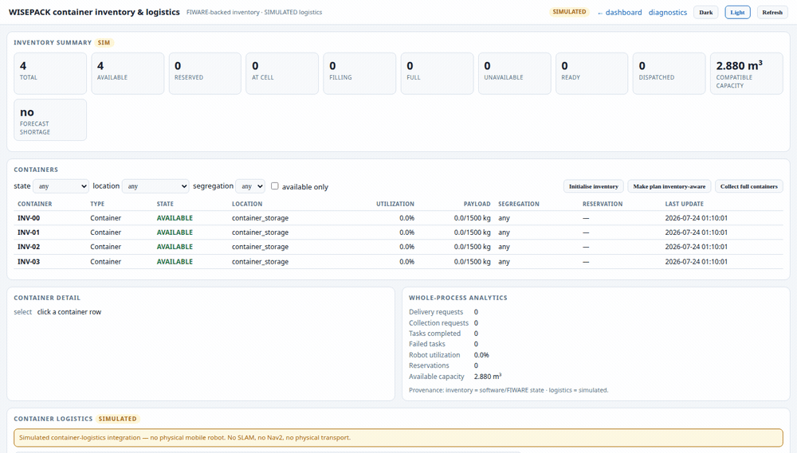

## 13f. Container logistics

`wisepack_core/logistics.py` provides a typed `ContainerTransportTask`
(deliver empty / remove full / replace unavailable / move to inspection / return
to storage) and a fully **deterministic, tick-driven** simulation of a single
mobile robot over a fixed facility map (storage, packing cell, inspection,
dispatch). Movement is a pure function of tick count - no wall-clock, no
randomness - so a test and the dashboard see identical motion. Task milestones
drive the matching audited inventory operation (an arriving delivery moves the
container to the cell; a completed collection dispatches it).

`/logistics` (<http://127.0.0.1:8080/logistics>) renders the facility map,
containers at each location, the simulated robot, and pending/active/completed
transport tasks. It is labelled **"Simulated container-logistics integration - no
physical mobile robot"**: there is no SLAM, no Nav2 and no physical transport.

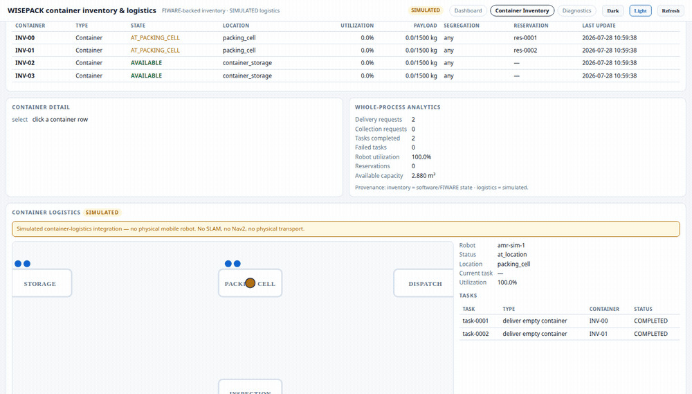

## 13g. Analytics

Whole-process analytics carry explicit provenance (measured / simulated /
derived / unavailable):

- **Cutting** - pipes evaluated, cut candidates, recommendation, containers
  avoided, cuts, cutting/handling time, kerf loss, cuts executed, resulting
  segments (`provenance: simulated_cutting_measured_packing`).
- **Inventory** - available capacity by segregation group, reservations,
  shortage events, container counts by state, revision (`provenance:
  software_state`).
- **Logistics** - delivery/collection requests, task duration, request-to-arrival
  time, failed tasks, mobile-robot utilization (`source: simulated`).

The action-event timeline has category filters (packing, cutting, inventory,
logistics, anomaly, operator, FIWARE), and `/diagnostics` adds Cutting, Inventory
and Logistics status panels alongside the ROS topic and FIWARE mapping diagnostics.

## 13b. What is live, simulated and future

| Capability | Current source | Status | FIWARE |
|---|---|---|---|
| Packing optimizer | real software | **measured** | compact plan summary |
| Digital Twin validator | real software | **measured** | validation result |
| Task generator | real software | deterministic | scenario summary |
| Strategy comparison | real software | **measured** | compact summary |
| Perception, `sim` (default) | simulator | simulated | detected count |
| Perception, `camera` | real camera + perception provider | **measured pose** (not a measured detection rate) | detected count |
| Robot execution | simulator | simulated | actions + KPIs |
| HitL approval | real workflow | **measured** | approval state |
| Cut-aware whole-process planner | real software | **measured** | cut proposal / result |
| Container inventory (lifecycle) | real software | **measured** | per-container semantic state |
| Container logistics (transport) | simulator | simulated | task + robot state |
| Anomaly source | simulator/adapter | architectural demo | mapped |
| ROS 2 / DDS transport | Vulcanexus Fast DDS | **real** | - |
| FIWARE event mapping | Orion-LD DDS bridge | **live** | - |
| Physical 2-D camera | **live with `WISEPACK_PERCEPTION_SOURCE=camera`** | real | detected count |
| Physical RGB-D camera (the proposal's depth pipeline) | future | not implemented | no |
| MoveIt2 execution | future | not implemented | no |

The `/diagnostics` page renders this table live and, in ROS/FIWARE mode, marks
each topic `ACTIVE` / `WAITING` / `SIMULATED SOURCE` / `FUTURE INTERFACE`.
**Deliberate simulation is never shown as a failure.**

## 13c. Diagnostics page

<http://127.0.0.1:8080/diagnostics> (linked from the dashboard header). Read-only,
for local engineering and interview transparency:

- **Runtime overview** - mode, uptime, run/scenario id, scenario revision, stage,
  approval state, heartbeat age, action sequence and gap-free check, per-panel
  data source.
- **Component status** - an allowlisted roster (generator, perception, optimizer,
  twin validator, orchestrator, robot sim, anomaly sim, dashboard, Orion-LD,
  Mongo-DDS), each labelled measured / simulated / external.
- **ROS topic diagnostics** - a fixed allowlist from the contract (no arbitrary
  `ros2` commands), with per-topic status, type, expected source and FIWARE
  mapping.
- **Simulated, unavailable and future interfaces** - the honesty table above.
- **Operation timing** - durations by stage, optimization time, anomaly→hold
  latency, DDS→FIWARE latency; each labelled measured / derived / unavailable.
- **FIWARE mapping diagnostics** - parsed from the generated bridge config.
- **Message & event inspector** - the latest of each message kind, length-capped.

**Security.** The page and its scripts expose **no** environment dumps,
credentials, tokens, keys, file contents, Docker socket, or shell execution.
Container facts come only from an allowlisted host-generated file
(`scripts/collect_runtime_status.sh`, restricted to the three `wisepack-*`
container names). A safe support bundle is produced by
`./collect_wisepack_diagnostics.sh` - allowlisted files only, with a secret-scan
guard that aborts if anything sensitive is found. `tests/test_diagnostics.py`
enforces all of this.

## 14. KPI definitions

**The denominator rule.** Volume reduction compares **required container
capacity** = (containers used × capacity each):

```
volume_requirement_reduction_pct =
    100 × (baseline_required_capacity − optimized_required_capacity)
        / baseline_required_capacity
```

Total pipe **material volume must never be the denominator**. It is identical for
both algorithms - nothing an optimizer does changes how much steel exists - so
using it produces a number that cannot distinguish a good plan from a bad one.
There is a test asserting exactly this.

Other definitions worth stating: `packing_density_gain_pct` is a **relative**
gain (30%→60% is +100%, not "+30"); absolute percentage points are reported
separately. Container counts use containers *actually holding a placement*. A
rate with zero attempts is **`not measured`**, never `0` - "no attempts yet" and
"0% success" are different statements.

Full list: `items_generated`, `items_packed`, `unplaced_items`,
`containers_baseline`, `containers_optimized`,
`container_utilization_{baseline,optimized}_pct`, `packing_density_gain_pct`,
`unused_capacity_reduction_pct`, `volume_requirement_reduction_pct`,
`optimization_time_ms`, `placements_validated`, `replans`,
`simulated_pick_attempts`, `simulated_pick_success_rate_pct`,
`simulated_end_to_end_success_rate_pct`, `operator_interventions`,
`fiware_events_logged`, `dds_to_fiware_latency_ms`.

## 15. Isaac Sim physical execution

**"Physical" here means contact physics, not a physical robot.** This section
describes physically simulated execution inside NVIDIA Isaac Sim 6.0.1: an
articulated robot model, rigid bodies, gravity, friction and collision response.
No hardware is involved anywhere in this repository.

### Why a physics simulator, and not just a nicer picture

A geometry-only digital twin can show you **where an object is supposed to go**.
That is genuinely useful, and it is what the Digital Twin panel does. But it
cannot answer the questions that decide whether a plan survives contact with a
real cell:

* can the arm actually **reach** that pose, or is it outside the envelope?
* does the object **strike a container wall** on the way in?
* does it **rotate during release**, so the orientation the plan assumed is not
  the orientation it ends up with?
* where does it **finally settle** once gravity and friction have had their say?

Isaac Sim closes that gap. It takes the plan WISEPACK already approved and tests
it against a robot model and contact physics, which turns the digital twin from
a passive drawing of an intended result into an **executable and observable
model of the physical process**. Problems become visible before anyone commits
to hardware: insufficient clearance, unreachable approach poses, container-wall
contact, unsafe release heights, poor final orientation.

The four-cylinder scene here is deliberately simple. Its value is not the scene,
it is the **integration pattern**: an approved plan crossing a backend-neutral
contract into a physics engine, and measured outcomes crossing back. That
pattern is what scales to richer facilities, container types, tooling, sensors
and manipulation skills.

Isaac Sim 6.0.1 has been validated on this GPU server with the current NVIDIA
driver stack, and runs smoothly enough for interactive viewing and for repeated
WISEPACK demonstrations.

The platform also **opens a path toward** synthetic data generation, domain
randomization and reinforcement-learning experiments. Those are opportunities
this integration makes reachable. **None of them is implemented here**, no
synthetic perception training has been performed, and no simulation-to-real
transfer has been validated. Simulation also does **not** remove the need for
validation in a real cell; it reduces how much you discover there for the first
time.

### From Isaac Sim to a real robot

The WISEPACK workflow contains **no Isaac-specific commands**. The orchestrator
sends backend-neutral ROS 2 commands and receives backend-neutral feedback, and
the simulator-specific code lives entirely in the Isaac adapter.

```
WISEPACK planning and approval
    -> common execution contract
        -> Isaac adapter today (xArm 7 or Panda, selected at run time)
        -> real xArm 7 adapter in a future deployment
```

The impact of that shape is practical: planning, operator approval, FIWARE
traceability, dashboard logic and run correlation can stay **unchanged** when a
real arm appears. A hardware backend implements the same lifecycle the Isaac
adapter implements today - reset, ready, execute, progress, failure, cancel,
home - and the layers above it do not need to know which one answered. That is
substantially less integration effort than rewriting the workflow for hardware.

This is a reusable contract, **not proven robot code**. Nothing validated in
Isaac will drive a real arm unchanged. A real deployment still requires:

* the robot hardware driver;
* calibration between robot, cameras, tools and facility frames;
* certified safety functions and a risk assessment;
* real collision geometry and joint, velocity and force limits;
* hardware-specific motion planning and tuning;
* physical validation in the cell.

What transfers is the **contract and the orchestration**. What gets replaced or
extended is the **hardware adapter and the safety layer**.

### The backend itself

An **optional execution backend** that performs the approved placements with a
**selected manipulator** in **NVIDIA Isaac Sim 6.0.1**, instead of resolving them
with the built-in logical robot model.

```bash
./run_wisepack_dashboard.sh isaac              # live stack + dashboard + physics
./run_wisepack_dashboard.sh isaac-fiware       # ...and state read back from Orion-LD
WISEPACK_ISAAC_HEADLESS=1 ./run_wisepack_dashboard.sh isaac    # over SSH
./run_wisepack_demo.sh --isaac-sim             # acceptance demo + physical smoke run
./run_wisepack_demo.sh --isaac-sim --no-fiware
./scripts/validate_isaac_sim.sh                # the physical smoke test on its own
```

### Supported robots

Which arm executes is a **configuration choice**, not a code change.
`config/isaac_robots.yaml` is the single tracked definition of every supported
robot; the launcher, the simulator, the orchestrator, the web API and the test
suite all read it through `wisepack_core.robots`. There is no second robot list
in Python, in HTML or in JavaScript, and `tests/test_isaac_robots.py` fails the
build if one appears.

| Robot | Status | DOF | Reach | Gripper | Why it is here |
|---|---|---|---|---|---|
| **UFACTORY xArm 7** | `experimental` | 7 + gripper | 0.71 m usable | UFACTORY parallel, one driven joint + five PhysX mimic joints | **The preferred robot.** It matches the physical hardware available to this project, so what is exercised in simulation is the arm a real deployment would use |
| **Franka Emika Panda** | `validated` — and the **current default** | 7 + 2 fingers | 0.78 m usable | two independently driven fingers | The **regression backend**. WISEPACK has no physical Panda; this profile exists so that adding a second robot can be *shown* not to have broken the first, and it still completes 4/4 items |

**Preferred is not the same as default, and the difference is deliberate.** The
plan was to make the xArm 7 the default once its complete smoke run passed. It
does not yet: a four-item run completes 3/4, for the reason set out in
[Measured xArm 7 behaviour](#measured-xarm-7-behaviour-and-what-is-not-yet-solid).
So `default_robot` in `config/isaac_robots.yaml` is still `panda` and the xArm
profile is marked `experimental`. Promoting it on the strength of a
single-item run would put the label ahead of the measurement. Select it
explicitly — `WISEPACK_ISAAC_ROBOT=xarm7`, or the dashboard's Robot selector —
and change one line in the registry when the four-item run passes.

Both are loaded from NVIDIA's asset server at runtime
(`/Isaac/Robots/Ufactory/xarm7/xarm7.usd`,
`/Isaac/Robots/FrankaRobotics/FrankaPanda/franka.usd`). Nothing is committed to
this repository.

Every number in a robot profile was **measured from the installed asset**, not
taken from a datasheet — the joint names and their order, the joint limits, the
end-effector link, the home configuration, and in particular the
**tool-centre-point**: for the xArm gripper the finger *link origins* sit at the
knuckles, 70 mm short of the fingertips, and using them put every one of the four
grasp descents exactly that far above the object. The value in the file is the
fingertip standoff read from the finger meshes' world bounding box.

The adapter re-checks every claim against the articulation it actually loaded
before a single joint is commanded, because **Isaac does not fail loudly when a
robot configuration is wrong for an asset**: a joint name that is not in the
articulation resolves to an empty index list and the command silently does
nothing, and a wrong end-effector link yields a Jacobian for a different body, so
the arm converges confidently to the wrong pose. Both read as physics problems.
A mismatch therefore produces `ROBOT_MODEL_INVALID`, a **DEGRADED** backend and a
**disabled approval button** — never a best-effort run.

### Startup: the stack first, Isaac alongside it

The launcher does **not** wait for Isaac Sim before bringing up the ROS stack and
the dashboard. It resolves the robot, starts Isaac, and then starts the stack
immediately while a watcher reports Isaac's progress. Measured on this host with
a warm shader cache: the dashboard answers at **~20 s** and Isaac reports READY
at **~28 s**, against **~76 s** before — and on a cold cache the old ordering
left port 8080 closed for minutes.

Starting the UI earlier **authorises nothing**. Every gate is unchanged: no
motion before operator approval, no approval before an active run, and no
approval before a `SCENE_READY` correlated to that run, its scenario revision,
its scene fingerprint, its robot id and that robot's profile revision, with the
home pose verified. Coming up early shows the operator *more* about why they
cannot approve yet.

Diagnostics gains a **Startup processes** table — process, scope, PID, expected,
running, exit code, last heartbeat, last error — written by the two launchers
that own processes and read from `results/startup-host.json` and
`results/startup-stack.json`. It exists because `docker ps` cannot answer the
question that matters: a container whose ROS stack died on its first line is
still `Up`. When there is no active run, Diagnostics names the **specific
blocker** rather than only showing `IDLE`.

### Switching robots from the dashboard

Selecting the other arm and pressing **Reset run & generate** is **not** a scene
reset. The adapter and the USD model are chosen when the Isaac process starts and
cannot be changed afterwards, so a robot change is a **host restart**:

```
same robot        SCENE_RESET_REQUESTED -> RESETTING_SCENE -> SCENE_READY
different robot   ROBOT_SWITCH_REQUESTED -> STOPPING_OLD_ROBOT
                  -> STARTING_NEW_ROBOT -> SIMULATOR_READY
                  -> BUILDING_SCENE -> SCENE_READY
```

The launcher starts a **supervisor** (`scripts/isaac_supervisor.py`) that owns
the Isaac process group. The container may write **one kind of file** into one
launcher-owned directory, naming **one allowlisted verb** — `switch_robot` — with
identifiers the supervisor *compares*, never executes. No Docker socket, no host
shell, no command string, no signal, no pid. The requested robot is validated
against the tracked registry **before** the running simulator is stopped, so a
request naming an unknown arm costs a refusal rather than a dead cell.

**The old simulator never receives the new robot's scene request.** It is still
subscribed while it shuts down and would rebuild its own workcell and acknowledge
it with its own robot id — which is exactly the misleading partial reset this
replaces. The scene request goes out only after the host reports a *new
generation* running the requested robot.

Every started process gets an incrementing **simulator generation**, stamped on
every command and report. The robot id alone cannot separate two instances:
switching A → B → A returns to the same id while being a different process with a
different scene, and during any switch the dying and the starting simulator are
briefly on the DDS domain together.

The dashboard shows four values separately — **active**, **requested**, **host**
and **acknowledged scene** — and the header follows the *host*, never the
selection, so it cannot name an arm that is not on the stage. Approval stays
disabled for the whole transaction and re-opens only on a `SCENE_READY` matching
the run, the revision, the fingerprint, the robot, its profile revision and the
generation. A failure holds in `ROBOT_SWITCH_FAILED`, keeps the requested robot
as the selection, and never falls back to the previous arm.

Measured on this host, warm cache: xArm 7 → Panda in **12 s** end to end (scene
gate closed at +2 s, new scene verified at +12 s), and the reverse in **14 s**.
A same-robot reset restarts nothing.

### Selecting a robot

Resolution order, highest first:

1. an explicit `--robot <id>` on the simulator command line;
2. `WISEPACK_ISAAC_ROBOT` exported in the environment (for automation);
3. the dashboard's **Robot** selector — the draft for the *next* run;
4. `default_robot` in `config/isaac_robots.yaml`.

The environment sits above the draft on purpose: the override exists for
automated validation, and a validator that exports it must not be overruled by
whatever a browser last left in the draft. An unknown or disabled id **raises**
rather than falling through to the next source — a typo that quietly selected
another arm would produce a run whose artefacts name a robot that never moved.

```bash
WISEPACK_ISAAC_ROBOT=xarm7 \
WISEPACK_ISAAC_VIEW_MODE=desktop \
WISEPACK_ISAAC_HEADLESS=0 \
./run_wisepack_dashboard.sh isaac

WISEPACK_ISAAC_ROBOT=panda \
WISEPACK_ISAAC_VIEW_MODE=desktop \
WISEPACK_ISAAC_HEADLESS=0 \
./run_wisepack_dashboard.sh isaac
```

```bash
./scripts/run_wisepack_isaac.sh --list-robots        # what is configured
./scripts/run_wisepack_isaac.sh --robot xarm7 --self-test
WISEPACK_ISAAC_ROBOT=panda ./scripts/validate_isaac_sim.sh
```

The robot is **not** stored in `config/local.env`. That file describes *this
host* and is untracked; which arm to run is a public scenario choice.

### The Robot selector in the dashboard

The Scenario panel carries a **Robot** dropdown whose options come from
`GET /api/config/robots`, not from markup. It publishes a public-safe subset of
each profile — identity, capability and status — and never asset URLs, prim
paths or joint names.

* Shown as a live selector in `isaac` and `isaac-fiware`. In the logical modes it
  becomes a fixed **"Execution source: Logical workflow simulator"** line, because
  offering a choice between two arms neither of which will move is worse than
  offering none.
* It edits a **draft for the next run**. Changing it never touches a running
  scene; only *"Reset run & generate"* carries it into a run, and the
  confirmation says so explicitly when the robot is about to change.
* Dashboard polling can never revert a selection — the same rule the preset
  dropdown follows.
* When a run is active it shows **`Running now: <robot>`** and
  **`Next: <robot>`** side by side, so the two are always distinguishable.
* An incompatible robot/preset pair is refused **with the reason naming the
  robot**, before the button is pressed.
* Robot switching is refused outright while an item is being carried.

The active robot also appears in the header badge
(`execution: ISAAC SIM / XARM 7`), in the Simulator View, in Diagnostics, in the
scene acknowledgement, in the run-correlation stamp that FIWARE projections
carry, and in the generated run artefacts.

### What the first xArm 7 iteration does and does not do

The xArm 7 executes the **same skill sequence** as the Panda — `HOME`,
`MOVE_TO_PICK`, `GRASP`, `LIFT`, `MOVE_TO_CONTAINER`, `RELEASE`, `SETTLE`,
`VERIFY` — under the same safety rules: no motion before operator approval, no
pick before an exact current-run `SCENE_READY`, stale commands and feedback
rejected by run id and revision, pre-pick object sanity checks, bounded reset and
homing, and a safe hold on any model or controller failure.

It carries the **same two stated limitations** as the Panda backend, unchanged:

* **item poses are still ground truth.** No camera, no detector, no pose
  estimator. Perception integration is a separate development step and was
  deliberately not bundled with the robot migration;
* **the grasp is still the temporary fixed joint.** The carry is idealised; the
  release and everything after it are real PhysX.

Two things are **specific to this arm** and are configuration, not code:

* **the workcell moved for it.** The default layout was sized for a Panda's reach
  and puts the bin's far inner corner 0.766 m from the base at retreat height —
  outside a 0.71 m arm. Measured by servoing the real articulation to all four
  inner corners at three heights: at the Panda bin position two of the twelve
  poses fail to converge, and the empirical boundary sits between 0.711 m
  (reached) and 0.725 m (missed). So the bin moved 60 mm nearer the base, the
  pick row moved with it, the pick pitch widened from 110 mm to 130 mm because
  this gripper is physically wider when open, and the spectator camera was
  re-aimed from a captured frame. Both ends of the contract derive the layout
  from the same profile, and `robot_id` is hashed into the scene fingerprint, so
  the two cannot silently disagree about where anything is;
* **its gripper has one driven joint.** `drive_joint`; the other five follow
  through `PhysxMimicJointAPI` and are never commanded.

### Measured xArm 7 behaviour, and what is not yet solid

Measured on `isaac_cylinders_smoke`, seed 42, Isaac Sim 6.0.1, CPU physics.

| | xArm 7 | Panda |
|---|---|---|
| `scripts/validate_isaac_sim.sh` | **PASSED** | **PASSED** |
| one-item final-position error | 18 / 24 / 27 mm | 11 / 13 mm |
| four-item run | **3 of 4** completed | **4 of 4** completed |
| four-item errors | 18, 172, — , 9 mm | 11, 157, 58, 54 mm |
| scene-reset validation (`--reset-test`) | **PASS** — container cleared, 4/4 respawned at source, home to 0.001 rad, grasp released, first item of the new run completed | unchanged |

A **single-item** pick-and-place is reliable and its accuracy is comparable to
the Panda's.

A **four-item** run is not yet reliable. The recurring failure is not the pick,
the carry or the release — it is the arm **disturbing a neighbouring source
object** while working the row, after which the pre-pick sanity check correctly
refuses that item ("`is 108 mm from its expected source pose (limit 80 mm)`")
rather than reaching for something that is no longer where the plan says. The
refusal is the safety gate doing its job; the disturbance is the defect.

The cause is structural, not a tuning value: **differential IK has no collision
awareness and no null-space control**. A 0.71 m arm mounted on the table has to
fold considerably to work a bin 0.3–0.6 m away, and the elbow and wrist end up
in whatever configuration the servo drifts into — which is the same space above
the table where the remaining cylinders sit. Widening the pick pitch from 110 mm
to 150 mm and moving the row away from the bin took a four-item run from 1/4 to
3/4; the remaining failure is the item nearest the bin, on the transit path.

#### xArm 7 motion stability

The arm visibly oscillated. It was **instrumented before anything was changed** —
joint positions, velocities, commanded deltas, TCP error, IK residual,
manipulability, joint-limit margin, per tick, through one full pick-and-place
(`scripts/probe_motion.py`). Three causes, all measured:

| | measured |
|---|---|
| **Redundant null-space drift** — a 7-DOF arm has one spare degree of freedom and damped least squares says nothing about where it should sit | joint 7 travelled **5.89 rad** to achieve **0.28 rad** of net change (21×); joint 2 reversed direction **26 times** while the tool was converging |
| **Fixed damping near singularities** | manipulability collapsed from **0.05–0.07** in the pick poses to **0.0013–0.0020** over the container — 35–50× |
| **Commanded steps larger than achievable** | commanded joint delta sat at **0.0524 rad** every tick, which is exactly the joint's 3.14 rad/s limit at 60 Hz |

Two hypotheses were **ruled out** by the same data: the solver already re-seeds
from the measured joint state every tick, and the joint ordering and
tool-centre-point are validated against the articulation at startup.

The minimum justified fix — a null-space pull toward the profile's home posture,
Chiaverini variable damping below a manipulability threshold, and a per-tick step
clamp below the velocity limit — is **per robot and off by default**, so the
Panda is untouched. Re-measured on the same probe:

| | before | after |
|---|---|---|
| total joint travel | 57.50 rad | **18.66 rad** (−68%) |
| direction reversals | 177 | **50** (−72%) |
| ticks to complete the sequence | 696 | **437** |
| worst goal: ticks with the tool moving *away* | 104 of 284 | **0 of 57** |

**This is not collision-aware planning**, and none of it makes the item below
untrue.

**This is not fixed by moving coordinates further.** It is what a motion planner
is for, and this iteration does not have one — see the roadmap. Nothing in the
code claims otherwise: `RobotProfile.is_motion_planner` is `False`, the
diagnostics row says `no motion planning`, and the registry refuses a profile
that names a controller no adapter provides.

**`ISAAC SIM / XARM 7` is a simulation result.** The Isaac xArm adapter drives a
simulated articulation in PhysX. It is *not* a driver for a physical xArm, shares
no code with one, and nothing it produces may be described as a real-robot
result. A hardware adapter would implement the same `IsaacRobotAdapter`-shaped
contract against the UFACTORY SDK and would have entirely different failure
modes — which is exactly why the contract is a separate interface rather than
something inside the Isaac state machine.

### Two different concepts, never conflated

| | |
|---|---|
| **Data source** | `sim` / `ros` / `fiware` - where the **dashboard reads state from** |
| **Execution backend** | `simulated` / `isaac` - **who moves the item** |

Isaac is **not** a fourth data source. A run can be executed by Isaac and
observed through FIWARE; a simulated run can be observed over ROS. The dashboard
shows both, separately, and neither is inferred from the other. The header badge
reads `ISAAC SIM / PHYSICS` only when a physical backend is genuinely reporting;
existing simulated execution is never relabelled.

The launch argument is `execution_backend:=simulated|isaac`. When `isaac` is
selected the orchestrator **never calls** `WorkflowEngine.step_execution()` -
that is the single-authority guarantee. There is no moment at which a simulated
outcome and a physical outcome both claim the same placement, because only one of
the two code paths is reachable.

```
 WISEPACK generator + optimizer      (unchanged: same scenario, same packing)
            |
     accepted plan  ── operator approval gate ── (unchanged)
            |
     ROS 2 / DDS bridge              /wisepack/isaac/command   (std_msgs/String)
            |
     Isaac Sim 6.0.1                 selected robot + PhysX, procedural scene
     pick → carry → orient → RELEASE → gravity settles the item
            |
     execution feedback              /wisepack/isaac/feedback  (std_msgs/String)
            |
     dashboard / FIWARE action trail (unchanged topics and entities)
```

### Read this before quoting a physical result

**Isaac Sim 6.0.1 is required**, with an NVIDIA GPU. Discovery order:
`ISAAC_SIM_ROOT`, then known server locations, **newest first** - an older major
version is never silently selected, because 5.x has a different core API.

**Isaac runs on the host**, in its own bundled Python, while WISEPACK may run in
Docker with host networking. They meet on the DDS wire on a shared
`ROS_DOMAIN_ID` and nowhere else. The launcher scrubs the host ROS environment
and then restores Isaac's *own* - sourcing `/opt/ros/jazzy/setup.bash` into that
interpreter puts an ABI-incompatible `rclpy` ahead of Isaac's and crashes inside
its C extension.

**GUI is the default** when `DISPLAY` is set; the launcher falls back to headless
automatically and says so. `WISEPACK_ISAAC_HEADLESS=1` forces it.

**No perception.** No camera, no detector, no pose estimator. Item poses are
**ground truth** - the simulator spawned the items, so it knows where they are.
Extension point: `wisepack_core.isaac_transform.table_pose_for_index`.

**Temporary fixed-joint grasp.** When the gripper closes, the item is welded to
the selected robot's end-effector link with a USD fixed joint, removed the
instant the gripper opens. The
**carry is therefore idealised**: the item cannot slip or rotate in the fingers.
A real parallel-jaw grasp of a smooth steel pipe is exactly where friction
modelling matters most, and this iteration does not model it.

**The release and everything after it are real.** The joint is destroyed *before*
the item falls. The drop, the impact, the roll, the contacts with the walls and
with items already placed, and the final resting pose are resolved by PhysX with
no assistance. **No item is ever teleported into the container.**

**Target pose ≠ measured pose.** A released cylinder rolls. Every item reports
its measured final pose and its distance from the planned one, and that error is
never rounded away or replaced by the target. Millimetre agreement with the
optimizer is not claimed.

### What the placement error actually is

`placement error` here is the **mean final-position error after release and
settling**. It is worth being exact about, because it is easy to read as
something it is not:

* WISEPACK computes a **planned target pose** for the object;
* the robot carries the object and **releases it above the container**;
* **gravity and contacts decide** where it comes to rest;
* the reported distance is between the **planned object-centre position** and the
  **measured object-centre position after settling**.

It is **not** a clearance gap, and it is **not** a robot joint-position error.

`axis error` is the **angular difference between the planned principal cylinder
axis and the axis the cylinder settled at**. It reflects rotation during release,
contact with a wall or another object, and the settling itself.

### Measured results, before and after clearance-aware release

The first iteration released each object directly above its planned pose. A dense
plan puts items flush against the container walls, and a reference screen
recording of that first iteration confirms what that looks like: the held
cylinder is lowered until it **rests on the container rim**, partially outside
the interior, and is released from there. The same wall-flush release is visible
on the first and the last item of the run.

The second iteration clamps the release point into the container interior (see
below) and leaves the plan untouched, so the error is still measured against the
original planned pose.

Both runs: `isaac_cylinders_smoke` seed 42, four items, WISEPACK stack in Docker
driving Isaac Sim on the host, all four items settled inside the container in
both runs.

| item | position error before | after | axis error before | after |
|---|---|---|---|---|
| item-001 | 43 mm | **13 mm** | 41 deg | **0 deg** |
| item-002 | 23 mm | 30 mm | 10 deg | 25 deg |
| item-004 | 67 mm | **19 mm** | 42 deg | **1 deg** |
| item-003 | 60 mm | 79 mm | 36 deg | **1 deg** |
| **mean** | **48 mm** | **35 mm** | **32 deg** | **7 deg** |

Read this honestly. In this **single seed-42 run**, the **mean position error
decreased from approximately 48 mm to approximately 35 mm** and the **mean
orientation error decreased from approximately 32 degrees to approximately 7
degrees**. The orientation change is the larger one: objects mostly settle in the
orientation the plan assumed. But the improvement is **not uniform**.
Two items improved sharply, `item-002` was slightly worse, and `item-003`
regressed from 60 mm to 79 mm - it settled 78 mm along the container's long axis
from its planned position, consistent with landing near an already-placed object
and sliding. These are single seeded runs, not a statistical result.

**What changed, exactly.** The container was **not** modified: it remains
300 x 220 x 150 mm inner, the same scene, the same seed, the same release height
(`drop_height` 0.06 m). Only the release point moved, by these clearances:

| setting | value | override |
|---|---|---|
| wall clearance | 10 mm | `WISEPACK_ISAAC_RELEASE_WALL_CLEARANCE_MM` |
| object-to-object clearance | 8 mm | `WISEPACK_ISAAC_RELEASE_OBJECT_CLEARANCE_MM` |

Per item that moved the release inward by 14, 14, 21 and 23 mm.

**Wall contacts are not instrumented.** Nothing in this repository counts or
detects them, so no contact-reduction figure is claimed here, and the orientation
error is not offered as evidence of one. What is measured is that the **mean
orientation error decreased from approximately 32 degrees to approximately 7
degrees in this single seed-42 run**.

`wisepack_core.isaac_transform.safe_release_pose` derives the release point from
the container inner dimensions, the cylinder radius and length, the configurable
wall and object clearances, and the release height. An object whose planned pose
is already clear of the walls is **not** moved. The object still approaches from
above, stays clear of the walls before release, is released over a valid interior
region, and settles through PhysX. **It is never teleported to the desired pose.**

**The release happens at the rim, not at the planned depth**, and that is the
largest single source of the error above. A good packing plan puts items *flush*
against the container walls - that is what makes it a good plan - so lowering a
held item to its planned depth scrapes the wall and the arm stalls. The sequence
therefore stops the descent at `rim + item radius`, releases there, and lets the
item fall the rest of the way. Closing that gap means **clearance-aware
placement**: the optimizer leaving a few millimetres beside each wall for the
gripper, at a small cost in density. That is second-iteration work.

**An item is not complete because the gripper opened.** After the release the
backend waits for the rigid body to come to rest - below both a linear and an
angular velocity threshold for a stable interval, or until `settle_timeout` - and
then verifies it exists, is inside the container footprint, is above the floor
and is not perched above the rim.

**Small smoke scenario, not the benchmark.** `isaac_cylinders_smoke` is four
bench-scale pipe segments into one open-top bin, sized for the arm (⌀ ≤ 70 mm for
an 80 mm gripper; length ≤ 250 mm; horizontal axes only). It is **not** a packing
benchmark and contributes nothing to the measured baseline-versus-optimized
result in [§2](#2-what-this-demonstrator-proves). The 40-item
`mixed_pipes_dense` benchmark is deliberately not the physical default - forty
robotic cycles is twenty minutes of watching an arm. The Isaac modes default to
the smoke preset; an explicit `WISEPACK_PRESET` is always honoured.

The WISEPACK stack and the Isaac scene both call
`build_scenario(preset, seed)`, so object ids, dimensions and masses match **by
construction**. There is no second hard-coded object list.

### Contract

Two `std_msgs/String` topics carrying versioned JSON - no custom messages, so
Isaac's bundled interpreter never needs a colcon-built package:

| topic | writer | payload |
|---|---|---|
| `/wisepack/isaac/command` | orchestrator | `IsaacCommand` |
| `/wisepack/isaac/feedback` | Isaac | `IsaacFeedback` |
| `/wisepack/execution/backend` | orchestrator | which backend is authoritative → FIWARE `executionBackend` |

Schema `wisepack-isaac/1.0`, defined once in `wisepack_core/isaac_contract.py`
and imported by **both** ends from that same file. A mismatched schema MAJOR is
refused rather than best-effort parsed. Feedback states - `READY`,
`MOVING_TO_PICK`, `GRASPING`, `LIFTING`, `MOVING_TO_CONTAINER`, `RELEASING`,
`SETTLING`, `ITEM_COMPLETED`, `ITEM_FAILED`, `RUN_COMPLETED`, `RUN_FAILED`, plus
the scene lifecycle `RESET_REQUESTED`, `RESETTING`, `SCENE_READY`,
`RESET_FAILED` - map
onto the **existing** workflow stages, so the timeline, the audit trail and the
FIWARE `stage` attribute keep their vocabulary. There is no parallel
dashboard-only state machine.

Physical events reach FIWARE as ordinary `ActionEvent`s with actor `isaac_sim` on
the existing `/wisepack/action/event` topic: simulator ready, item grasped, item
released, item settled, item failed, run completed. No separate FIWARE model.

**Nothing in the contract is Isaac-specific** - no USD path, no PhysX setting, no
joint. A real robot cell answering these two topics is a drop-in replacement, and
`wisepack_orchestration/isaac_bridge.py` would not change: it contains no
simulator imports. Nothing outside `simulators/isaac/` imports `isaacsim`,
`omni`, `carb` or `pxr`, and a test asserts it.

### Starting a new scenario: the scene-reset handshake

Generating a new scenario changes the *software* world. Isaac's world is
physical, and it does not change by itself: the previous run's cylinders are
still lying in the container, and a new plan assumes every one of them is back at
its source pose. Dispatching against that sends the arm after objects that are
not there.

So a new scenario is a **command**, not a redraw:

```
operator: "Reset run & generate"
  orchestrator ──RESET_SCENE(scenario_revision=N)──▶ Isaac
  Isaac        ──RESETTING───────────────────────────▶
               stop the arm · release the grasp joint · home the robot
               stop the timeline · delete every item · rebuild from (preset,seed)
               play · re-home · zero velocities · settle · PROVE it is usable
  Isaac        ──SCENE_READY(scenario_revision=N)────▶
  orchestrator: approval and picking unblock - for revision N exactly
```

Until `SCENE_READY` arrives **for that exact revision**, the orchestrator refuses
approval and refuses to dispatch, and says which of the two it is waiting for. A
reset that does not complete within its budget becomes `RESET_FAILED` → hold and
`DEGRADED`; it never silently proceeds. Every pick is additionally sanity-checked
before any motion: right revision, item exists, no grasp joint still attached,
pose readable, and the item is not already sitting in the destination container.

**The stage is mutated only while the timeline is stopped.** This is the
load-bearing detail. Deleting a rigid body while physics is playing invalidates
the PhysX *tensor simulation view* for the whole stage - the arm's articulation
included - and the first live attempt did exactly that: items rebuilt correctly,
`SCENE_READY` published, and the very next read of the arm's joints raised
`Simulation view object is invalidated`. A scene that reports ready while the
robot is unusable is the failure this handshake exists to prevent, so the order
is stop → mutate → play, and `SCENE_READY` is published only after the rebuilt
world has been *proven* usable (joints readable and finite, every item's pose
readable, no grasp joint surviving).

In-process reset is therefore **enabled** - "Reset run & generate" works in the
Isaac modes and no launcher restart is required. That is not an assumption; it is
what the bounded live validation measures:

```bash
./scripts/run_wisepack_isaac.sh --reset-test --max-runtime 900
```

It executes one item for real, requests a new scenario, and asserts on the
rebuilt world. Latest run:

| check | result |
|---|---|
| item placed in the container before the reset | 1 |
| container cleared by the reset | yes |
| source objects respawned at their source poses | 4 / 4 |
| Robot returned home | max joint error 0.001 rad, against the selected robot's own home configuration and tolerance |
| grasp joint released | released |
| first item of the *new* run executed | completed, settled in the container |

The scenario dropdown is restricted to presets a physical cell can actually
execute (≤ 8 items, ≤ 78 mm diameter); the 40-item benchmark is a software
scenario and stays one.

### Coordinates

`wisepack_core/isaac_transform.py` is the **only** place WISEPACK units become
Isaac units - millimetres to metres, min-corner to centre, container frame to
world. Scattered axis swaps are individually plausible and collectively
unfalsifiable, and the failure they produce (a mirrored container) looks like a
physics problem rather than an arithmetic one. It is covered by tests that need
no GPU, including a full world→pose round trip and a reachability check on every
placement.

### Tuning and troubleshooting

`pre_grasp_height`, `lift_height`, `container_clearance`, `drop_height`,
`settle_timeout`, `linear_velocity_threshold`, `angular_velocity_threshold` and
the rest are `WISEPACK_ISAAC_*` environment overrides - see
[`simulators/isaac/README.md`](simulators/isaac/README.md) for the full list,
the module layout and the robot state machine. Inconsistent combinations are
rejected before a robot moves.

* **Isaac never reports READY.** The orchestrator holds for 240 s then enters
  DEGRADED with a diagnostic; the launcher gives up after 300 s and prints the
  log tail. Check `echo $ROS_DOMAIN_ID` on both sides and
  `ros2 topic info /wisepack/isaac/feedback`. First launch compiles shaders and
  can take several minutes; it caches in `~/.cache/ov` afterwards.
* **`ModuleNotFoundError: rclpy` or a crash inside it.** The host ROS
  environment leaked in. Use the launcher rather than calling `python.sh` from a
  shell that has sourced ROS.
* **No display.** `WISEPACK_ISAAC_HEADLESS=1`.
* **`Could not find assets root folder`.** The robot asset is fetched from NVIDIA's
  asset server at runtime; the machine needs outbound HTTPS or a local Nucleus
  root.

Ctrl-C stops the dashboard stack and **only** the Isaac process that invocation
started, by PID and process group. No pattern kills; the existing protection
against competing WISEPACK containers is unchanged. A startup failure propagates
a non-zero exit status.

### Simulator View - watching the physical run

A dedicated dashboard page at **`/simulator`**, reached from the header
navigation. The nav item appears **only when the active execution backend
actually offers a visualization**, because a permanently-visible link that opens
"stream unavailable" trains an operator to ignore it.

```bash
WISEPACK_ISAAC_STREAMING=1 ./run_wisepack_dashboard.sh isaac
# then open http://127.0.0.1:8080/simulator
```

It shows live connection state, the execution backend, the current item and
physical state, the stream endpoint and camera, and Connect / Open full screen /
Copy endpoint controls.

**Execution telemetry and visual streaming are different transports, on
purpose.** ROS 2 and FIWARE carry state and metadata - item ids, stages,
timestamps, measured poses. Rendered frames never travel on those paths: they
would bloat the regulatory record with data that has no audit value and make the
dashboard's poll loop as slow as the renderer. The picture comes over WebRTC.

#### Choose how to watch Isaac

One variable picks the whole configuration, because the individual switches
interact - WebRTC needs headless, desktop needs a display. Copy-paste one of
these.

**A. GUI on the host desktop (NoMachine / Sunshine+Moonlight)**

```bash
WISEPACK_ISAAC_VIEW_MODE=desktop \
WISEPACK_ISAAC_HEADLESS=0 \
./run_wisepack_dashboard.sh isaac
```

An Isaac Sim window opens on the active display. **No WebRTC variables and no
stream ports are involved.** Watch the host desktop with your existing NoMachine
or Moonlight session - WISEPACK does not install, start or manage those. The
launcher refuses this mode when no display exists rather than failing inside the
renderer.

**B. Headless WebRTC server - local or forwarded**

```bash
WISEPACK_ISAAC_VIEW_MODE=webrtc \
WISEPACK_ISAAC_STREAMING=1 \
WISEPACK_ISAAC_HEADLESS=1 \
./run_wisepack_dashboard.sh isaac
```

The dashboard advertises `http://127.0.0.1:49100` and labels it *"Local/forwarded
endpoint. For a remote native client, set `WISEPACK_ISAAC_STREAM_HOST` to an
address reachable by that client."* Use this when the client runs on this host or
reaches it through a forward.

**B2. Headless WebRTC server - direct remote native client**

```bash
WISEPACK_ISAAC_VIEW_MODE=webrtc \
WISEPACK_ISAAC_STREAMING=1 \
WISEPACK_ISAAC_HEADLESS=1 \
WISEPACK_ISAAC_STREAM_HOST=<reachable-server-address> \
./run_wisepack_dashboard.sh isaac
```

That exact address becomes the native-client endpoint in Simulator View.

**No Isaac window opens in either case.** Two ports, and the native client needs
*both*:

| port | protocol | purpose |
|---|---|---|
| 49100 | **TCP** | signalling / negotiation |
| 47998 | **UDP** | media |

**A normal browser cannot display this stream, and an SSH TCP tunnel alone
cannot carry it** - the media is UDP, and Isaac Sim 6.0.1 ships no in-browser
client. Use NVIDIA's **Isaac Sim WebRTC Streaming Client** with direct or VPN
connectivity to both ports.

##### Bind address is not the advertised address

`WISEPACK_ISAAC_STREAM_HOST` controls **what the dashboard tells a client to
dial**. It is not a bind address:

| | |
|---|---|
| **bind/listen** | `0.0.0.0:49100` - Kit binds every interface, always |
| **advertised** | `127.0.0.1` by default, or whatever you set |

Setting it opens nothing; leaving it unset closes nothing. Access control is a
firewall or SSH-forward decision, and the stream is unauthenticated. Simulator
View shows both rows so the distinction is visible rather than assumed - a
native client once connected successfully through the server's reachable address
while the page displayed `http://127.0.0.1:49100`, which is the reporting bug
these two rows exist to prevent. WISEPACK never discovers or publishes this
host's public IP.

**B3. Host-specific values, without retyping them**

```bash
cp config/local.env.example config/local.env
# edit the placeholders
./run_wisepack_dashboard.sh isaac
```

`config/local.env` is **optional**, git-ignored and **unrelated to whether WebRTC
works** - it only saves retyping host-specific values that would otherwise be
exported inline. It is read by an allowlist parser and never sourced as shell.
See [§ Host-specific settings](#host-specific-settings-configlocalenv).

**C. GUI *and* WebRTC at the same time**

**Not supported here - choose desktop or webrtc.** In Isaac Sim 6.0.1 the
livestream extension captures the application framebuffer and the shipped
configuration (`isaacsim.exp.full.streaming.kit`, and the standalone
`livestream.py` example) runs it headless with `--no-window`. I did not find a
supported way to render an on-screen GUI window *and* serve the same framebuffer
over WebRTC, and I did not verify one experimentally, so the launcher makes the
two modes mutually exclusive rather than letting you configure something that
half-works.

**D. Telemetry only**

```bash
WISEPACK_ISAAC_VIEW_MODE=none \
WISEPACK_ISAAC_HEADLESS=1 \
./run_wisepack_dashboard.sh isaac
```

Physical execution still runs and remains fully visible as **state and
telemetry** - stages, item outcomes, measured poses, the audit trail. There is
simply no video.

The launcher prints the resolved configuration at startup - view mode, headless,
DISPLAY, streaming, advertised host, signalling and media ports, and where to
watch - so what you got is never in doubt. It never prints secrets or this
host's SSH port.

#### Streaming environment variables

```
WISEPACK_ISAAC_VIEW_MODE          # desktop | webrtc | none  (picks the rest)
WISEPACK_ISAAC_STREAMING=1        # opt-in; off by default
WISEPACK_ISAAC_STREAM_HOST        # default 127.0.0.1 (loopback)
WISEPACK_ISAAC_SIGNAL_PORT        # default 49100  (TCP, negotiation)
WISEPACK_ISAAC_STREAM_PORT        # default 47998  (UDP, media)
WISEPACK_ISAAC_VIEWER_PORT        # optional separate viewer port
WISEPACK_ISAAC_STREAM_URL         # explicit endpoint (reverse proxy / forwarded port)
```

Isaac Sim 6.0.1 extensions used: **`omni.kit.livestream.app`** (framebuffer
capture) and **`omni.kit.livestream.webrtc`** (the WebRTC server), configured
through `/exts/omni.kit.livestream.app/primaryStream/`. The enable sequence
follows the package's own
`standalone_examples/api/isaacsim.simulation_app/livestream.py`. Older releases'
`omni.services.livestream.webrtc` is **not** present in this install and is not
used.

The streamed viewport is pinned to a **fixed spectator camera** framing the
table, the selected robot, the pick row and the container together - not the default
development viewport, which on a fresh stage points away from the workcell.

**No in-browser client ships with Isaac Sim 6.0.1** (verified by inspection: no
HTML or JS anywhere in the installed `omni.kit.livestream.*` extensions). The
stream is consumed by NVIDIA's native *Isaac Sim WebRTC Streaming Client*, so
the dashboard reports `embeddable=false` and offers an **Open live simulator**
action plus a copyable endpoint rather than an iframe that could only ever render
blank. The Simulator View still shows availability and connection diagnostics.

The livestream serves **one client per instance**; a second viewer on the same
signal port is refused. The launcher checks the port first and fails with a clear
message rather than letting Kit silently fall back to a different port - which
would publish a URL pointing at some other, older stream.

#### Access and security

The stream has **no authentication and no encryption**, and - measured on this
install - **Kit binds the signal port on `0.0.0.0`, every interface**, whatever
host WISEPACK advertises. `WISEPACK_ISAAC_STREAM_HOST` controls the *published
URL*, not the bind address: it cannot restrict who can reach the port.

Access control is therefore **external and your responsibility**. WISEPACK
defaults to advertising loopback and never contacts an external IP-discovery
service to learn a public address, but on a reachable host you must add a
firewall rule.

```bash
# local
http://127.0.0.1:49100

# remote - forward the signal port over SSH, then connect to localhost
ssh -p "${WISEPACK_SSH_PORT}" -L 49100:127.0.0.1:49100 <user>@<host>
```

<a id="host-specific-settings-configlocalenv"></a>

##### Host-specific settings: `config/local.env`

**Optional.** Nothing in it is required to run WISEPACK, and **nothing in it
decides whether WebRTC works** - every value can be exported inline instead. It
exists so host-specific settings do not have to be retyped on every invocation:

```bash
cp config/local.env.example config/local.env
# edit the placeholders
./run_wisepack_dashboard.sh isaac
```

| key | safe default when unresolved |
|---|---|
| `WISEPACK_SSH_PORT` | **none - 22 is never assumed** |
| `WISEPACK_ISAAC_STREAM_HOST` | `127.0.0.1`, labelled *local/forwarded* |

Every value resolves in the same order, most explicit first:

1. an already-exported environment variable - an operator override always wins;
2. `config/local.env`;
3. a safe default, or an explicit *unresolved* diagnostic.

`WISEPACK_SSH_PORT` has a fourth step before giving up: the server-side field of
`$SSH_CONNECTION` when the launcher runs inside an SSH session. Failing that it
becomes the literal `<ssh-port>` with a diagnostic. **Port 22 is never assumed** -
a wrong port produces a command that looks right and connects nowhere. A template
copied but not edited counts as unresolved, so `YOUR_SSH_PORT` and
`YOUR_REACHABLE_SERVER_ADDRESS` never reach a command line.

The file is read by an **allowlist parser** in `scripts/lib_local_env.sh` - only
the two keys above are honoured, and it is **never sourced as shell**, so a
backtick or `$(...)` in a value is data rather than a command.

`config/local.env` is git-ignored and **never committed**; only the template is
tracked. Real values stay out of tracked files, README examples, test fixtures,
generated artefacts and logs.

Any other remote access needs a deliberate decision: a firewall rule scoped to
one client address, or an authenticated HTTPS reverse proxy. Do not publish these
ports.

#### Other ways to watch, and what is not claimed

| how | managed by | descriptor transport |
|---|---|---|
| Isaac GUI on the host desktop | you | `desktop` |
| NoMachine / Sunshine+Moonlight to that desktop | **externally managed** | `desktop` |
| Isaac WebRTC livestream | WISEPACK launcher | `webrtc` |
| simulated backend, or headless with streaming off | - | `none` |

WISEPACK never installs, starts, restarts, reconfigures or stops NoMachine or
Sunshine. When Isaac runs with a GUI on a real display, the descriptor simply
reports `desktop` so the Simulator View says something true instead of
"unavailable" to an operator who is already looking at it.

#### Backend-neutral by design, and XR-ready

The dashboard consumes one descriptor -
`wisepack_core/visualization.py` - with fields `backend`, `available`,
`transport`, `viewer_url`, `stream_id`, `camera_name`, `interactive`, `status`
and `message`. It contains **no simulator concept**: no extension name, no kit
setting, no USD path. Isaac-specific discovery lives in
`simulators/isaac/streaming.py` and nothing else crosses that boundary, so a real
robot cell exposing `webrtc`, `rtsp`, `mjpeg` or `none` needs no dashboard change.

**XR is deliberately not implemented here, and deliberately not blocked.** Three
concerns are kept apart - robot execution, state telemetry, and rendered
visualization - so a future XR client is a new *consumer* of existing contracts
rather than a change to them. It can consume the same execution-state contracts,
the same timestamped robot/object poses in named frames with a documented
transform (`wisepack_core/isaac_transform.py`), and this same descriptor to find
a spectator stream - **without** depending on the HTML dashboard or scraping
pixels out of the video. No XR dependency exists in `wisepack_core`, in the
orchestration layer, or in the Isaac adapter.

**Why that matters operationally.** A flat dashboard is a good instrument panel
and a poor spatial one. An operator deciding whether to authorise a pick is
reasoning about a three-dimensional cell through two-dimensional views. XR is the
obvious way to close that gap, and the contracts above are what would make it
possible without redesigning WISEPACK.

A future XR operator experience could let an authorised operator:

* view the digital twin **as if standing inside or beside the facility**;
* see the robot, containers, tools and planned trajectories **in spatial
  context**, at true scale;
* read the current workflow state and warnings **without relying only on a flat
  dashboard**;
* **select or confirm** objects and target locations by looking at them;
* leave **spatial annotations**: waypoints, keep-out zones, correction hints;
* **preview a planned robot action before authorising it**;
* supervise a remote cell under the **same WISEPACK approval gate and audit
  trail** that the dashboard uses today.

**Extending the digital twin beyond the camera.** XR can combine the direct
camera image with robot state, object models, facility geometry and information
from additional sensors. Objects that are outside the active camera view, or
temporarily occluded, can still be shown when their pose is known from the
digital twin, from earlier observations, or from auxiliary sensors. That is
useful for understanding hidden constraints, for obstacle avoidance and for
recovering an object that has moved out of view.

To be precise about what that is and is not: **XR does not see through
obstacles.** XR can visualize occluded or out-of-camera-view objects **when their
state is available from the digital twin or other sensors**. If nothing knows
where an object is, XR will not know either, and showing a confident model of an
object whose position is stale would be worse than showing nothing.

The technical foundation already exists for the reasons above: the same
backend-neutral execution state, the timestamped poses in named frames, the
documented transforms and the visualization descriptor that were introduced for
the Isaac backend are exactly what an XR client would consume.

**This is future work. No XR client is implemented in this repository.**

#### Runtime artefacts

NVIDIA's streaming stack writes trace files - `NvStreamer-*.etli`, about 7 MB per
minute of streaming - into the **process working directory**. Launched from the
repository root that is the repository root, and one WebRTC session left 53 MB of
binary traces among the source. They are NVIDIA runtime artefacts, not WISEPACK
files.

So the simulator runs from a directory the launcher owns:

| `WISEPACK_RESULTS_DIR` | working directory | lifetime |
|---|---|---|
| set | `${WISEPACK_RESULTS_DIR}/runtime/nvstreamer/<run-id>/` | **retained** beside the run's other evidence |
| unset | `${TMPDIR:-/tmp}/wisepack-isaac-runtime/<run-id>/` | removed on exit by the launcher that created it |

Only the launcher's own temporary directory is removed; a results directory
belongs to the operator and its contents are diagnostics. Every path handed to
the simulator is absolute, so changing the working directory cannot break imports
or asset discovery. `NvStreamer-*.etli` is also in `.gitignore` as a backstop -
belt and braces, because an ignored 53 MB artefact is still 53 MB in the way.

#### Process ownership

Ctrl-C stops the dashboard stack, the WISEPACK container and **only** the Isaac
process group that invocation started - including the WebRTC service Kit owns as
part of that process. Ownership is recorded by the new session leader writing its
own PID (which is the process-group id): `setsid` *forks*, so the shell's `$!` is
a parent that exits immediately, and a cleanup keyed on it finds nothing to kill
and leaves Isaac holding the GPU. Cleanup waits on **group membership**, not on
the leader, because Kit spawns children that outlive their parent during
shutdown; it escalates TERM→KILL within a bounded window and then verifies the
group is gone. No `pkill` patterns are used anywhere, and unrelated Isaac
sessions, ROS nodes, containers, SSH sessions, NoMachine and Sunshine are never
touched.

If `htop` appears to show dozens of Isaac entries, those are **threads** - Kit is
heavily threaded and htop lists TIDs by default (press `H` to hide them). They
are not separate simulator instances.

## 15a. Real camera perception

**A camera is not an execution backend.** WISEPACK has three orthogonal axes and
this section adds the third:

```text
WISEPACK PERCEPTION        where the OBJECT OBSERVATIONS come from
    sim
    camera
      +-- fasterrcnn_bottle      <- the provider in use today
      +-- (future) yolo_obb, rgbd_pose, segmentation, ...
          |
          v
generic WISEPACK object observations   (PhysicalObservation / ObservationBatch)
          |
          v
packing / workflow / Digital Twin validation / operator approval
          |
          v
EXECUTION BACKEND          who PERFORMS the approved placements
    simulated | isaac
```

**WISEPACK owns perception.** A *provider* is an implementation behind that
boundary, selected with `WISEPACK_PERCEPTION_DETECTOR`; the perception SOURCE
answers only "where do observations come from", never "which neural network
processed the image". Adding a second method is a new file in
`perception/providers/` and nothing above it moves.

Every combination is legal and none implies another:

| | `simulated` execution | `isaac` execution |
|---|---|---|
| **`sim` perception** | the default, unchanged | §15, unchanged |
| **`camera` perception** | real objects, logical execution | real objects, physical execution |

Selecting a camera changes **where the objects come from** and nothing else. The
existing execution-backend selection, the dashboard data source (`sim`/`ros`/
`fiware`), the packing algorithms, the validator, the approval gate and the
audit trail are all untouched.

The current camera detector reuses the Faster R-CNN bottle-detection
implementation developed in HARMONY. In WISEPACK it is isolated behind a generic
perception-provider interface, and bottles are used only as physical proxies for
cylindrical workpieces.

> In camera mode, their detected physical position and orientation are
> transformed into domain-neutral WISEPACK object observations. This allows the
> planning and workflow layers to consume real perception data independently of
> the selected execution backend — and independently of which provider produced
> it.

### Simulated perception (the default)

```bash
WISEPACK_PERCEPTION_SOURCE=sim      # or simply leave it unset
```

No camera, no image, no detector. The generated ground truth is republished with
a seeded confidence and every event is labelled `simulated`. **This is what runs
when the variable is unset, and its behaviour is byte-identical to before this
feature existed** - `tests/test_perception.py` asserts exactly that.

### Real camera perception

```bash
WISEPACK_PERCEPTION_SOURCE=camera
```

Objects on a calibrated table are detected by the configured perception
provider, positioned on the calibrated plane, and converted into generic
WISEPACK object observations that the ordinary planning workflow consumes.
Today's provider is `fasterrcnn_bottle`; select another with
`WISEPACK_PERCEPTION_DETECTOR` once one exists.

#### The current provider: `fasterrcnn_bottle`

Nothing in the detector is reimplemented. The provider lives in
`perception/providers/fasterrcnn_bottle.py` and is the **only** detector-aware
code in the system. From [`hpcbg/harmony`](https://github.com/hpcbg/harmony),
directory `ai-bottle-detector-fiware/`:

| HARMONY component | How WISEPACK uses it |
|---|---|
| `camera.py` (`Camera`) | **Imported and used as-is.** Threaded `cv2.VideoCapture` frame grabber. |
| `pipeline.py` (`process_frame`) | **Imported and used as-is.** Faster R-CNN inference, ArUco homography, bottle/cap matching, position and yaw computation, annotated image rendering. WISEPACK computes no coordinate of its own. |
| `ros2_backend.py` (`Ros2DetectorBackend`) | **No longer used.** WISEPACK's perception service speaks HTTP only — see *No middleware on the host* below. |
| `config/config.json.tpl` | Read as the configuration template; WISEPACK generates its own `config.json` from it plus environment overrides, in a machine-local cache. HARMONY's checkout is never written to. |
| `setup.py` model download | The **destination and the Hugging Face URL** are reused rather than a second downloader being written. See *Model resolution* below. |
| `A4_calibration_sheet.pdf` | The calibration artefact. WISEPACK adopts HARMONY's coordinate system verbatim. |

What WISEPACK adds:

| New component | Why it was needed |
|---|---|
| `perception/perception_service.py` | The **generic, WISEPACK-owned** service: capture, health, one-shot detection, raw and annotated images, provider status. HARMONY's own preview endpoints live only in its legacy NGSI-v2 `main.py`, which §8 forbids requiring merely to see a picture — and running both would mean two processes opening one `cv2.VideoCapture`. |
| `perception/providers/fasterrcnn_bottle.py` | The **only** detector-aware code in the system. Converts this detector's bottle JSON into domain-neutral observations. |
| `wisepack_core/perception.py` | The domain-neutral perception model: source selection, `PhysicalObservation`, `ObservationBatch`, proxy geometry, work-area frame, model resolution, staleness. |
| `web/perception_client.py` | The dashboard's client. The dashboard never opens a camera and never imports torch. |

#### Prerequisites

* a camera reachable by OpenCV (a normal USB webcam is the supported case);
* `torch`, `torchvision`, `opencv-python`, `opencv-contrib-python` for the
  **detector service only** - the dashboard and the ROS stack do not need them;
* the trained weights (see below);
* the printed ArUco calibration sheet in view of the camera;
* a HARMONY checkout. Default `/data/arise/harmony/ai-bottle-detector-fiware`,
  overridable with `WISEPACK_HARMONY_PATH`.

#### Model resolution

The weights are **never committed to this repository**. They are resolved in
this order, and the answer is reported by `/health`:

1. `WISEPACK_PERCEPTION_MODEL_PATH`, if set. A configured path that does not exist
   is an **error**, not a reason to search elsewhere - silently loading
   different weights than the ones asked for is worse than reporting the miss.
2. `/data/arise/models/best_model.pth`, if present (the shared ARISE host copy).
3. `<harmony>/models/best_model.pth` - the exact destination HARMONY's own
   installer downloads into.
4. Otherwise **absent**, with a clear diagnostic naming every path searched, the
   Hugging Face repository and the command to fetch it. There is no cryptic
   `FileNotFoundError` out of `torch.load`: resolution is a filesystem question
   answered before torch is imported at all.

Fetch them with HARMONY's own installer (`python3 setup.py` in the HARMONY
repository), or directly:

```bash
curl -L --fail -o <harmony>/models/best_model.pth \
  https://huggingface.co/hpcbg/harmony-bottle-detector/resolve/main/best_model.pth
```

#### Calibration and the coordinate frame

**WISEPACK adopts HARMONY's calibration; it does not redesign it.** HARMONY
detects four ArUco markers (`DICT_ARUCO_ORIGINAL`, ids `11, 10, 15, 16` by
default) and computes a homography onto a plane whose corner coordinates are
declared in millimetres. With the shipped A4 sheet that plane is **130 × 130 mm
with the origin at marker 11**.

Every WISEPACK observation names its frame explicitly - `wisepack_workarea` by
default - and that frame **is** HARMONY's calibrated plane: WISEPACK applies no
transform of its own, so `x_mm`/`y_mm` are HARMONY's millimetres unchanged and
`yaw_deg` is its bottle→cap angle unchanged.

130 mm is small for a realistic WISEPACK work area. The extent is therefore
**configurable rather than hardcoded**, so a larger printed board is a
configuration change:

```bash
WISEPACK_HARMONY_CORNER_MARKERS=11,10,15,16     # marker ids, in plane order
WISEPACK_HARMONY_CORNER_EXTENT_MM=600           # side of the square, mm
WISEPACK_PHYSICAL_WORKAREA_WIDTH_MM=600         # declared WISEPACK work area
WISEPACK_PHYSICAL_WORKAREA_DEPTH_MM=600
WISEPACK_PHYSICAL_FRAME_ID=wisepack_workarea
```

An object measured outside the declared plane is **reported, never clamped or
rescaled** - silently moving a measurement destroys the evidence for the
calibration problem that produced it.

Two behaviours of HARMONY's pipeline are handled explicitly:

* **Only bottles with a matched cap are reported.** Without the cap there is no
  orientation, so `pipeline.py` skips the bottle. The reported count is
  therefore "objects with a resolved orientation", not "objects present".
* **An uncalibrated frame yields the sentinel `(1, 1)` for every object.** Those
  are not measurements. WISEPACK rejects such a batch as a **calibration
  failure** rather than planning from a pile of objects at one point.

#### Proxy-cylinder geometry

A calibrated 2-D detector measures **where** an object is, not how big it is.
Fabricating a diameter from a bounding box would feed an invented number into
the one part of this repository that is genuinely measured. So the dimensions of
the physical proxy objects are **declared**:

```bash
WISEPACK_PHYSICAL_PROXY_DIAMETER_MM=65     # default: an ordinary 0.5 l PET bottle
WISEPACK_PHYSICAL_PROXY_LENGTH_MM=215
WISEPACK_PHYSICAL_PROXY_WALL_MM=2          # for the mass-balance figures only
WISEPACK_PHYSICAL_PROXY_MATERIAL=carbon_steel
WISEPACK_PHYSICAL_PROXY_GROUP=A
```

Every item built from an observation is stamped `geometry_source:
"configured_proxy"`, and the dashboard shows it. **Measure your bottles and set
these** - the defaults are a documented default, not a measurement of the
objects on your table.

#### Starting it — the launcher does it for you

Configure it once, in `config/local.env`:

```bash
WISEPACK_PERCEPTION_SOURCE=camera
WISEPACK_PERCEPTION_CAMERA=2
```

and then start WISEPACK the way you always do:

```bash
./run_wisepack_dashboard.sh sim            # or ros / fiware / isaac / isaac-fiware
```

The launcher prints what it is doing and waits for the detector to be ready:

```text
[perception] perception source : camera
[perception] service URL       : http://127.0.0.1:22101
[perception] detector service  : starting
[perception] detector python   : /data/arise/harmony/torch_venv/bin/python (HARMONY torch_venv)
[perception] provider          : fasterrcnn_bottle (Faster R-CNN)
[perception] camera            : 2
[perception] service log       : /tmp/wisepack_perception.log
[perception] detector service  : ready
```

**The detector is a HOST process and the single owner of the camera.** It is
never moved into the WISEPACK container; the containerised dashboard reaches it
over `WISEPACK_PERCEPTION_SERVICE_URL` (`--net=host`, so `127.0.0.1` works).

**Which interpreter.** The service needs torch, torchvision, cv2, fastapi and
uvicorn, and the system `python3` has none of them — running it there produces
`ModuleNotFoundError: No module named 'uvicorn'`. So the launcher uses the
**provider's** own environment, resolved exactly as that provider's `run.sh`
resolves it (verified against the real installation, and deliberately not
`.venv`):

1. `WISEPACK_PERCEPTION_PYTHON`, if set (and executable — if not, that is an error,
   not a reason to look elsewhere);
2. `<WISEPACK_HARMONY_PATH>/../torch_venv/bin/python`, i.e.
   `/data/arise/harmony/torch_venv/bin/python` for the default checkout;
3. otherwise it **fails with a clear message**. There is deliberately no fall
   back to the system python, and the venv is never `activate`d into the
   launcher's shell.

**Already running one?** If a healthy detector is already answering at the
configured URL — because you started it by hand to watch its log, or to keep the
model loaded across WISEPACK restarts — the launcher reuses it, says so, and
**does not stop it on exit**:

```text
[perception] detector service  : already running (external; will not be stopped)
```

Only a service the launcher started is stopped by it, and only by PID/session —
never by process-name matching, so a WISEPACK run can never kill someone else's
detector.

**If it cannot start**, the launcher prints the reason and the tail of
`/tmp/wisepack_perception.log`, stops anything it started, and exits
with status `6`. It never continues into simulated perception behind a UI that
claims a camera.

`WISEPACK_PERCEPTION_CAMERA` accepts a device index (`2`), a device path
(`/dev/video2`) or a stream URL. **No `/dev/videoX` is hardcoded**; the template
default is documented and overridable. `AI_CAMERA` is honoured too, so an
existing HARMONY habit keeps working.

Its HTTP interface:

```text
GET  /health                            every health field below
GET  /api/v1/camera/snapshot            one JPEG frame       (no inference)
GET  /api/v1/camera/live                MJPEG preview        (no inference)
POST /api/v1/detect                     ONE-SHOT inference -> observation batch
GET  /api/v1/camera/last-detection      the current batch
GET  /api/v1/detection/image/annotated  the annotated detector result
GET  /api/v1/detection/image/raw        the exact frame that was analysed
```

**Inference is one-shot.** The MJPEG preview is raw frames only; Faster R-CNN
runs when someone asks for a detection and not otherwise. A plan that changed
under the operator while they read it would not be reproducible.

#### Every mode, unchanged

With `WISEPACK_PERCEPTION_SOURCE=camera` in `config/local.env`, the
ordinary commands are the ordinary commands:

```bash
./run_wisepack_dashboard.sh sim            # dashboard only, no ROS
./run_wisepack_dashboard.sh                # full ROS 2 / DDS stack
./run_wisepack_dashboard.sh fiware         # + Orion-LD read-back
./run_wisepack_dashboard.sh isaac          # camera perception + PHYSICAL execution
./run_wisepack_dashboard.sh isaac-fiware

# or directly on the launch file
ros2 launch wisepack_bringup demo.launch.py perception_source:=camera
```

#### No middleware on the host

The perception service speaks **HTTP only**. It imports no `rclpy`, publishes no
DDS, and the launcher sources no ROS environment for it.

That is deliberate. WISEPACK's validated middleware is the **containerized**
Vulcanexus / Fast DDS runtime — the one the Orion-LD DDS Enabler needs for
TypeObject propagation. Publishing from the host would have required a second
middleware installation there and created a parallel, unvalidated path to the
same NGSI-LD attributes; plain host ROS 2 is **not** equivalent to Vulcanexus
for that purpose.

So the split is:

```text
HOST                                   CONTAINER (Vulcanexus Jazzy, Fast DDS)
  camera, GPU, torch, model              WISEPACK ROS 2 nodes
  perception service (HTTP)  ── HTTP ──> orchestrator
                                           └─ publishes /wisepack/perception/*
                                              └─ Orion-LD DDS Enabler → NGSI-LD
```

The orchestrator is the **single DDS writer** for both perception topics, so the
audit path is unchanged and still travels the validated route. `sim` + camera
therefore needs no ROS anywhere at all.

> **Vulcanexus is not installed on the host; WISEPACK uses the containerized
> Vulcanexus runtime.** Its absence from `/opt` on the host says nothing about
> the WISEPACK stack, and the diagnostics page states it in exactly those terms.

`WISEPACK_PERCEPTION_SERVICE_URL` points the dashboard at the detector when it runs
on another host (default `http://127.0.0.1:22101`). The launcher can only start
a **local** service; if the URL names another machine and nothing is answering,
it says so instead of starting one that would be unreachable.

An **unrecognised** perception source is a start-up error, never a silent
fallback to the simulator. Both the dashboard and the ROS orchestrator resolve
the value the same way and let it raise before anything starts, so

```bash
WISEPACK_PERCEPTION_SOURCE=harmony_camera   # the pre-refactor value
```

**stops the process** with `unknown perception source 'harmony_camera'; known:
sim, camera` rather than quietly producing simulated detections for an
operator who asked for a camera.

#### Triggering a detection

Open <http://127.0.0.1:8080>, find the **Physical Perception** panel, and press
**Detect physical objects**. Equivalently:

```bash
curl -sX POST localhost:8080/api/command \
  -H 'Content-Type: application/json' \
  -d '{"command":"detect_physical_objects"}'
```

In the live modes the same command reaches the orchestrator over the ordinary
operator path, and the orchestrator fetches the batch over HTTP and republishes
it on `/wisepack/perception/*` from inside the container.

Each detection **replaces** the current observation. Move the bottles, detect
again, and WISEPACK re-plans from exactly the objects now on the table - never
those plus the ones that used to be there. A new batch is a new batch revision,
so any outstanding approval is revoked and the workflow returns to the gate.

In `sim` perception mode the command is **refused with a reason**. A button
labelled "Detect physical objects" that quietly ran the simulator would be a
lie, and a failed camera scan never falls back to simulated detections.

#### Dashboard

The **Physical Perception** panel appears only when the perception source is a
real one. It shows the annotated detector result - bounding boxes, confidences,
calibrated coordinates, orientation and the calibration overlay - the raw
analysed frame, the live camera feed, and:

```text
Source: PHYSICAL CAMERA          Detector: Faster R-CNN
Model: loaded / unavailable      Calibration: VALID / INVALID
Detected cylindrical objects: N  Last detection: <timestamp>
Frame: wisepack_workarea
```

plus the per-object table of `x`, `y`, `yaw`, confidence and the configured
geometry. The panel is **domain-neutral**: it says "cylindrical objects"
throughout, and the fact that bottles are the physical stand-in is stated once
in the proxy note served from the API. `tests/test_perception.py` fails the
build if a detector-specific string is ever hard-coded into the page.

#### Interfaces

| Interface | Direction | Payload |
|---|---|---|
| `GET /api/perception` | dashboard | source, health, current batch, poses, scene objects |
| `POST /api/command {"command":"detect_physical_objects"}` | dashboard | one-shot detection |
| `GET /api/perception/image/{annotated,raw,snapshot}` | dashboard | JPEG, proxied from the detector |
| `POST /api/v1/detect` (service) | HTTP | one-shot detection -> `ObservationBatch` |
| `/wisepack/perception/objects_json` | ROS 2, `std_msgs/String` | the WISEPACK-domain `ObservationBatch`, published by the **orchestrator** |
| `/wisepack/perception/status_json` | ROS 2, `std_msgs/String` | perception status, published by the **orchestrator** |

The WISEPACK topics are **not** in `all_topics()`, for the same reason the Isaac
channel is not: that contract is what has a publisher in *every* run, and these
two have one only with a real perception source. The orchestrator is their
single writer, so world state keeps one authority — and it publishes them from
inside the containerized Vulcanexus runtime, not from the host.

The provider's own upstream topics (`/bottle_detection/...`) are **not used**.
They belong to HARMONY's DDS-native backend, which WISEPACK no longer runs.

**No NGSI-v2 dependency.** None of this needs HARMONY's legacy FIWARE-v2 stack.
The detector service makes no `/v2` call, and WISEPACK's own DDS/NGSI-LD path is
unchanged.

#### Provenance

Every observation retains: `source`, `detector`, `model_id`, `confidence`,
`captured_at`, `frame_id`, `calibration_status`, `calibration_revision`,
`detector_class` and `detector_object_index`. It survives the JSON round trip
onto `WasteItem.observation`, so a plan can be traced back to the exact
detection and the exact calibration that produced it.

**Two timestamps, and they are not interchangeable.** The batch carries both:

| Field | Meaning |
|---|---|
| `captured_at` | **When the camera frame was acquired.** This is the measurement instant: staleness is computed from it, and a future Isaac synchronizer places objects as they were at this moment. **Empty when no frame was acquired** — a batch that failed before the grab has no capture time, and inventing one would assert a measurement that never happened. |
| `requested_at` | When the detection was *asked for*. Diagnostics only. It is what makes a slow cold start legible (`requested at T, frame at T+31 s`, while torch loads a 159 MB model) and it is the only timestamp a batch that never reached the camera can carry. |

An unstamped batch is never reported stale — it is reported **failed**, which is
the accurate thing to say about it.

#### KPI reporting - detector confidence is not a detection rate

**A confidence of 0.94 does not become "vision detection rate = 94%".** Those
are different quantities: one is the detector's certainty about objects it
*did* find, the other needs ground truth about objects it might have *missed*.
With a real detector active, KPI1 reports:

```text
Vision detection rate:
not measured - real detector active; no ground-truth trial
```

The mean confidence is still published, under `physical_detector_mean_confidence`
- a name that cannot be read as a rate - and per-object confidences are shown in
the panel. `tests/test_perception.py` asserts the rate stays `not measured`.

#### Failure handling

Every one of these is a **visible failed batch** with its reason, never an empty
successful scan and never a silent fallback:

| Failure | What you see |
|---|---|
| camera absent / disconnected | `Camera: unavailable`, batch error naming the configured device |
| model unavailable / download failed | `Model: unavailable`, every path searched plus the fetch command |
| model loading failure | the loader's own error, with the resolution report |
| no objects detected | status `empty`, **not** an error - an empty table is a valid measurement |
| calibration markers absent / invalid | `Calibration: INVALID` and an explicit rejection of the sentinel coordinates |
| inference failure | batch error naming the exception |
| malformed ROS message / detector output | failed batch; partially malformed entries are dropped **and counted** |
| HARMONY service unavailable | `service_reachable: false`; camera/model report `unknown`, never `false` |
| stale observation | `observation_stale` with the batch age |

A camera or model failure never takes an unrelated WISEPACK component down. In
the ROS stack the workflow **waits** at the detection stage rather than failing
the run, because with a real camera the objects arrive when the operator asks.

#### Advanced: running the detector by hand

Not the normal path — the launcher does this for you. It is useful when you want
the detector's log in its own terminal, want to keep the model loaded across
WISEPACK restarts, or are debugging the service itself. A healthy service
started this way is **reused** by the launcher and is not stopped by it.

```bash
# what it resolved, without opening a camera or loading a model
/data/arise/harmony/torch_venv/bin/python \
    perception/perception_service.py --check

# run it
WISEPACK_PERCEPTION_CAMERA=2 \
/data/arise/harmony/torch_venv/bin/python \
    perception/perception_service.py --host 127.0.0.1 --port 22101

```

The service is HTTP-only; there is no ROS flag because there is no ROS in it.

Use the provider's detector interpreter, not `python3` — see *Which interpreter*
above. To point the launcher at a different one:

```bash
WISEPACK_PERCEPTION_PYTHON=/path/to/python   # in config/local.env
```

#### Troubleshooting

| Symptom | Cause and fix |
|---|---|
| panel absent | `WISEPACK_PERCEPTION_SOURCE` is unset or `sim`. It is the default. |
| launcher exits with status `6` | camera perception was requested and no detector could be made available. The reason and the log tail are printed above it; the launcher deliberately refuses to fall back to simulated perception. |
| `no perception detector interpreter found` | the provider's `torch_venv` is missing or `WISEPACK_HARMONY_PATH` points elsewhere. Create it (HARMONY's `setup.py`), or set `WISEPACK_PERCEPTION_PYTHON`. |
| `ModuleNotFoundError: No module named 'uvicorn'` in the detector log | the service was run with the system `python3` instead of the provider's `torch_venv`. Unset `WISEPACK_PERCEPTION_PYTHON` or point it at the right interpreter. |
| `unknown perception source 'harmony_camera'` | the value was renamed to `camera` in this refactor. Update `config/local.env`. |
| "Vulcanexus is not installed on the host" in diagnostics | expected and correct. WISEPACK uses the **containerized** Vulcanexus runtime; the host needs no middleware for camera perception. |
| `WISEPACK_PERCEPTION_PYTHON=... is not an executable file` | the explicit override does not exist. It is not silently replaced by the default — fix or unset it. |
| `perception service unreachable` | the service is not running, or `WISEPACK_PERCEPTION_SERVICE_URL` points elsewhere. |
| detector keeps running after Ctrl-C | it was started **outside** the launcher, so the launcher does not own it and will not stop it (by design). Stop it where you started it. |
| `Calibration: INVALID` | the four ArUco markers are not all in frame. HARMONY caches them once seen; show the sheet and detect again. |
| `Model: unavailable` | run `--check`; the message lists every path searched and the fetch command. |
| `camera ... delivered no frame` | wrong index, or another process holds the device - **including a second copy of this service, or HARMONY's own `main.py`**. Only one process may own the camera. |
| first detection takes ~30 s | normal: torch imports and a 159 MB Faster R-CNN loads on the first request only. |
| objects detected but count lower than expected | HARMONY only reports bottles whose **cap** it also matched - that is where orientation comes from. |
| coordinates all near `(1, 1)` | uncalibrated frame; WISEPACK rejects this rather than planning from it. |
| detected but `outside_workarea` in diagnostics | the declared work area is smaller than the calibrated plane; set `WISEPACK_PHYSICAL_WORKAREA_*_MM`. |

#### Next step: Isaac scene synchronization

Deliberately **not** implemented here. The interface for it exists and is
already exercised: `/api/perception` publishes `scene_objects`, a
backend-neutral list of

```json
{"object_id": "physical-cylinder-001", "object_type": "cylindrical_proxy",
 "frame_id": "wisepack_workarea",
 "pose": {"x_mm": 82.4, "y_mm": 46.1, "z_mm": 0.0, "yaw_deg": -31.0},
 "geometry": {"shape": "cylinder", "diameter_mm": 65, "length_mm": 215,
              "source": "configured_proxy"}}
```

A scene synchronizer needs an identity, a planar pose, a geometry and the frame
the pose is in - which is exactly this, and nothing else. **No consumer will
ever need to parse bottle-specific HARMONY JSON inside Isaac.**

## 16. Tests and evidence

```bash
python3 -m pytest tests/ -q                     # no ROS, no GPU, no Isaac required
WISEPACK_QOS_LIVE=1 pytest tests/test_qos_contract.py -q     # against a live graph
WISEPACK_BROWSER_ROS=http://127.0.0.1:8080 \
    pytest tests/test_dashboard_browser.py -q                # against a live dashboard
./scripts/validate_isaac_sim.sh                 # optional: the physical smoke test
```

The standard suite never requires Isaac Sim or an NVIDIA GPU. The Isaac smoke
validator is separate and **skips with exit code 77** - distinct from failure -
when the simulator or the GPU is genuinely absent.

| File | Covers |
|---|---|
| `test_generator.py` | determinism, dimension validity, segregation classes, JSON/CSV round trip |
| `test_validator.py` | every hard constraint H1-H9, hand-built violating plans, support-area union |
| `test_optimizer.py` | all placements validate, reproducibility, multi-container, honest selection, curated result computed not constant, speed |
| `test_kpi.py` | exact known cases, zero-baseline protection, the material-volume anti-fudge test, target labelling |
| `test_workflow.py` | approval gating, rejection→re-plan, frozen placements, dynamic events, audit-trail monotonicity |
| `test_ros_fiware.py` | reserved `status` leaf, bridgeable types, YAML↔contract agreement, generated mapping |
| `test_qos_contract.py` | no subscription requests Deadline/Liveliness; KPIs latched; events transient-local. With `WISEPACK_QOS_LIVE=1` it parses the **real running graph** from `ros2 topic info -v` |
| `test_launchers.py` | wrapper argument handling and exit codes, always-build, targeted cleanup |
| `test_simulator_view.py` | Simulator View and the backend-neutral visualization descriptor **without Isaac, a GPU, WebRTC or a browser**: desktop/webrtc/none transports, every connection state having operator wording, malformed descriptors degrading instead of raising, navigation restoration and active styling on all four pages, conditional Simulator View visibility, active-preset synchronisation and control locking, isaac vs isaac-fiware source reporting and the FIWARE degraded badge, launcher stream-option parsing and port guards, process-group ownership and cleanup, the SSH-port resolver's precedence, and that no tracked file contains a concrete SSH port |
| `test_isaac_backend.py` | the Isaac backend **without Isaac**: contract round trip and schema-major refusal, duplicate/stale `run_id` rejection, the coordinate layer including a full world→pose round trip and reachability, every physical state mapped onto an existing workflow stage, a fake simulator driving a complete run, the safety gate, settle/containment verdicts, launcher option parsing, and that `isaacsim` never leaks outside the adapter |
| `test_anomaly.py` | anomaly reactions (info/warning/critical), acknowledgement, honesty labels, no detection-KPI claim |
| `test_cutting.py` | cut conservation, lineage, min length, max cuts, kerf, coexistence, deviation, independent validator vs hand-broken inputs |
| `test_cut_optimizer.py` | genuine container-saving recommended, "No cut" when it does not pay (same scoring), bounded search, all strategies validated |
| `test_inventory.py` | 16-state transition table (valid/invalid), rejected+logged illegal moves, reservations, inventory-aware selection, FIWARE semantic state |
| `test_logistics.py` | deterministic transport tasks + robot motion, delivery→cell, collection→dispatch, failure handling, analytics |
| `test_whole_process.py` | cut HITL through the engine, separate cut vs packing approval, deviation/failure, inventory-aware planning, **CUTTING_REQUEST idempotency (6 cases)** |
| `test_behaviour_tree.py` | diagrams regenerate deterministically and contain the required nodes incl. anomaly hold/ack |
| `test_diagnostics.py` | no secret/env/Docker-socket leak, allowlisted containers, simulated/future not shown as failures, bundle allowlist |
| `test_dashboard_browser.py` | real Chromium: fails on any page error, console error, failed request or `refresh failed`. Verifies 3→2 containers on screen, the approval gate, re-plan → renewed gate, **Compare strategies renders all rows**, the anomaly panel holds on a critical event, the diagnostics page, and that **no advertised command is a dead button** |

Artefacts written to `results/` per run, all timestamped: `wisepack-run-*.json`,
`wisepack-actions-*.{jsonl,csv}`, `wisepack-placements-*.csv`,
`wisepack-scenario-*.{json,csv}`, `wisepack-kpis-*.{json,csv}`,
`wisepack-validation-*.md`, `wisepack-fiware-validation-*.md`,
`wisepack-dds-fiware-latency-*.{json,csv}`.

Figures in `images/generated/` are produced by running the real pipeline -
`./generate_demo_artifacts.sh` - never drawn from constants.

## 17. Limitations

Stated plainly, because a demonstrator that hides its edges is not evidence.

1. **No perception.** No camera, RGB-D, detector or 6D pose estimation.
   Extension point: `wisepack_sim/perception_sim.py::detect()`.
2. **The default backend has no robot.** No kinematics, no MoveIt2, no
   collision-free trajectories, and in that backend a pick outcome is a seeded
   coin flip. The Isaac backend is different: it runs contact physics and
   reports measured outcomes, but it is still a simulator and not hardware. The
   **optional Isaac Sim backend** ([§15](#15-isaac-sim-physical-execution)) does
   move a real arm against real PhysX contacts, but within its own stated
   limits: no perception, a temporary fixed-joint grasp during the carry, and a
   small 4-cylinder scenario rather than the packing benchmark. Its measured
   placement error against the plan is reported, never hidden. Still no MoveIt2
   and no collision-free motion planning.
3. **No radiation model.** `dose_class` is a label used to exercise priority and
   segregation machinery.
4. **Five of six geometry classes are bounding boxes.** Conservative, so plans
   are safe but pessimistic. Only the straight tube is exact.
5. **KPI4 is not met** - 33-50% measured, target >50%. See [§3](#3-what-is-simulated--read-this-before-quoting-any-number).
6. **Axis-aligned orientations only.** No arbitrary rotation, no curved-pipe
   collision geometry.
7. **FIWARE history is state-oriented.** No QuantumLeap/CrateDB/Grafana stack
   here; the append-only record is the JSONL artefact.
8. **No voice, gesture or gaze.** The proposal's multimodal HRI is represented by
   the dashboard command path only. (HARMONY has working Vosk/MediaPipe modules
   that plug into the same NGSI-LD attributes.)
9. **Single robot, single workstation.** No fleet coordination.
10. **Latency figures include HTTP polling.** The ROS→FIWARE number is an
    upper bound on true propagation delay, not a lower one.
11. **Orion-LD caches endpoint QoS.** Change a QoS profile and the running
    broker keeps offering the old one, producing incompatibility warnings that
    survive the fix. Restart it - see [§12](#12-ros-2--dds-contract).
12. **DDS-level liveliness detection is unavailable to subscribers here.** A
    generic bridge on the domain publishes with an infinite lease on every topic
    it discovers, so orchestrator loss is detected from the heartbeat counter
    stalling rather than from a DDS liveliness event.
13. **The GIFs are recorded in simulation mode** and say `SIMULATED` on screen.
    They demonstrate the operator workflow, not live ROS or FIWARE operation.
14. **Cutting is simulated, not physically controlled.** The cut-aware planner and
    its conservation/lineage validation are real software; the external cutting
    skill is a seam, with **no cutting-tool safety validation**.
15. **Container transport is simulated.** Deterministic tick-driven robot motion,
    **no physical mobile robot**, no SLAM and no Nav2.
16. **Inventory state is real software / FIWARE state**, but it models an
    operational inventory for the demonstrator - not a site asset-management system.

## 18. From here to TRL6

| Step | Work | Maps to |
|---|---|---|
| 1 | Replace `perception_sim.detect()` with YOLOv12-OBB + SAM2 + FPFH/ICP on real RGB-D | O1, KPI1, MS2 |
| 2 | Exact geometry for the five approximated classes (convex decomposition or voxel masks) instead of bounding boxes | O3, KPI4 |
| 3 | **Add the real xArm 7 execution backend** using the same ROS 2 execution contract, with hardware drivers, calibrated robot/camera/tool/facility frames, safety integration and hardware-aware motion planning. **Retain Isaac as the pre-deployment and regression-testing environment.** There are now two simulator levels - the lightweight logical simulator and the Isaac physics simulator - and the hardware backend is a **sibling of Isaac, not a replacement for all simulation** | O2, KPI2/KPI3, MS4 |
| 4 | Add **collision-aware motion planning** to the Isaac execution backend. This is the structural gap the xArm 7 migration exposed: differential IK has no collision model and no null-space control, so a shorter arm working a bench-scale cell folds into the space its own remaining source objects occupy and disturbs them. Moving coordinates further apart took a four-item xArm run from 1/4 to 3/4 and cannot take it further — see [Measured xArm 7 behaviour](#measured-xarm-7-behaviour-and-what-is-not-yet-solid) | O2, MS4 |
| 5 | Improve **clearance-aware release planning** to further reduce the measured mean final-position error after PhysX settling, currently about **35 mm** in the four-item Panda smoke run (down from about 48 mm, see [§15](#15-isaac-sim-physical-execution)). Then replace the temporary fixed-joint grasp approximation with a friction/contact grasp, and replace ground-truth poses with perception | MS4 |
| 6 | Calibrate the baseline against real EDF/CEA site practice so KPI4 is measured against reality, not a textbook packer | KPI4, MS6 |
| 7 | QuantumLeap + CrateDB + Grafana on the existing NGSI-LD entities for true historical retention | O5, MS5 |
| 8 | Re-attach HARMONY's Vosk voice and MediaPipe gesture modules to the same operator attributes | O4 |
| 9 | Replace the simulated external cutting skill with a validated physical cutting backend and site-specific safety integration | O3 |
| 9 | Replace the simulated container logistics with a real mobile-robot fleet (SLAM/Nav2) driving the same transport-task contract | O2 |

**Longer-term research opportunities, separate from the TRL6 demonstration.**
None of the following is required for the immediate demonstrator, and none is
implemented:

* more realistic facility and container models, including site-specific geometry;
* richer manipulation tasks beyond single-object pick and place;
* synthetic data generation and domain randomization for perception training;
* reinforcement-learning research where it is the appropriate tool;
* XR-assisted operator supervision (see
  [§16](#backend-neutral-by-design-and-xr-ready));
* simulator-to-real validation, which is the step that would let any Isaac
  result be treated as evidence about hardware.

**The highest-value next step is (2).** It is the only one that directly moves
the measured KPI4 number, it needs no hardware, and the bounding-box
approximation is currently the largest known source of pessimism in the result.

## 19. Attribution

Full detail in [NOTICE](NOTICE).

| From | Reused | Form |
|---|---|---|
| **TEMPO** | topic/QoS contract modules, Docker-only operation, `lib_validate.sh`, `clean_dds_shm.sh`, FastAPI dashboard structure, position-free topology, "KPI from artefact / not measured" pattern, two-theme tokens | adapted code |
| **HARMONY** | `generate_config.py`, `docker-compose.dds.yml`, `bridge_config.yaml` structure, latency measurement method, `orion_classify` rule, py_trees task pattern, and the hard-won DDS knowledge (Vulcanexus requirement, reserved `status` leaf, `value.data` nesting) | adapted code + documented findings |
| **HARVEST** | seeded task generator pattern, YAML dynamic-event model, scenario comparison, map-style rendering | **concepts only - no code.** HARVEST ships no licence file, so everything was re-implemented from scratch. |

---

**High Performance Creators Ltd** · WISEPACK · JARVIS Open Call 2 · EDF Pilot
Topic #1
